# abp 搭建个人网站教程
项目所用到的版本如下
abp 6.0
.net 6
vue2 

## 1) 初识ABP vNext与项目初建

###### ABP vNext 简介
ABP vNext（以下简称ABP）的前身是asp.net boilerplate，更多信息请看官网介绍。ABP官网：https://www.abp.io/

废话不多说，开始个人网站搭建之旅

> 默认已经有了.net core的开发环境，没有就去下载 https://dotnet.microsoft.com/download

######  创建项目
创建项目有很多种方式：

1. 纯手撸，使用vs手动创建新项目(熟手、巧手特区)

2. 借助abp官网模板直接傻瓜式创建，地址：https://abp.io/get-started
> 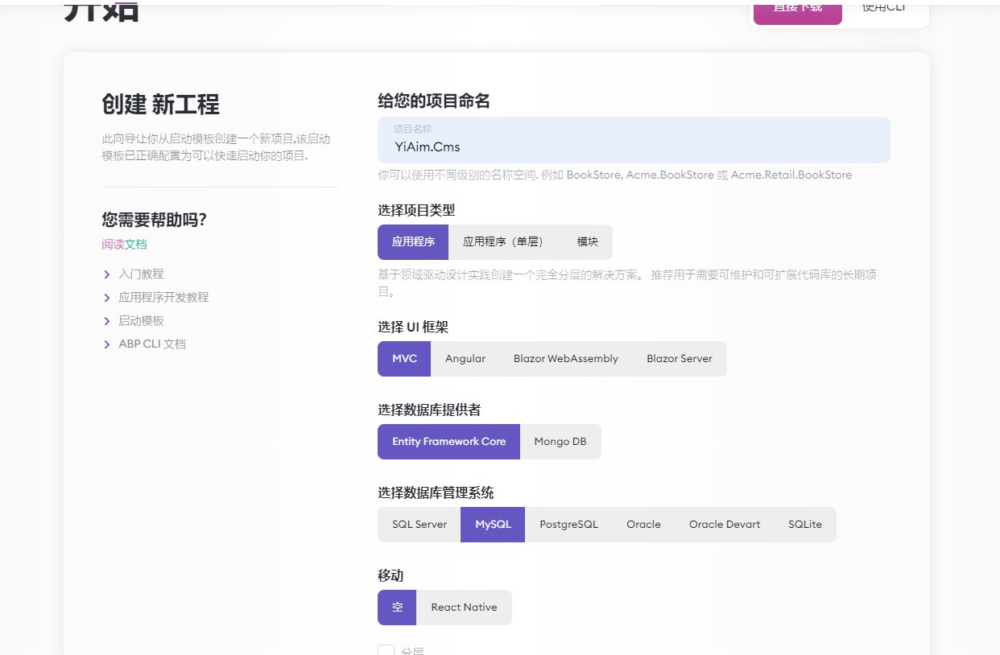
3. 第三种，abp cli
> 更多使用方式参考 https://docs.abp.io/zh-Hans/abp/latest/CLI
``` 
dotnet tool install -g Volo.Abp.Cli 
abp new xxxx
```
为了省事，项目就直接使用2方式创建
>项目类型选择应用程序,UI框架选择->MVC,数据库提供者选择->Entity Framework Core, 数据库选择->MySQL,移动端不需要，小项目也不需要将Web、http API分离，所以也不需要分层

创建项目完成，目录结构如下 (solutionItems是自己创建的文件夹，主要用来管理其他零散的文件如：Dockerfile、gitigore、README.md等)
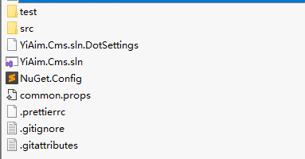
vs2022打开时目录结构
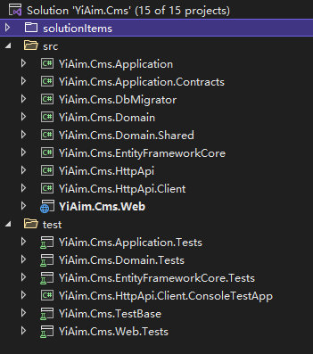

###### 让项目跑起来

1. 先更改 YiAim.Cms.Web 里面的  appsettings.json 里面的数据库连接串，同时也需要更改  YiAim.Cms.DbMigrator 里面的  appsettings.json 里面的数据库连接串
`"Default": "server=xxx;port=3306;user=xx;password=xxx;database=xx;charset=utf8;SslMode=none;Allow User Variables=True" `
2. 将YiAim.Cms.DbMigrator 设为启动项目，控制台选择 YiAim.Cms.EntityFrameworkCore，运行该项目进行数据库初始操作（这步很重要）
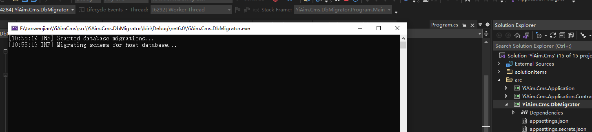
完成后，数据库中已经创建了表和初始化了系统自动的一些数据
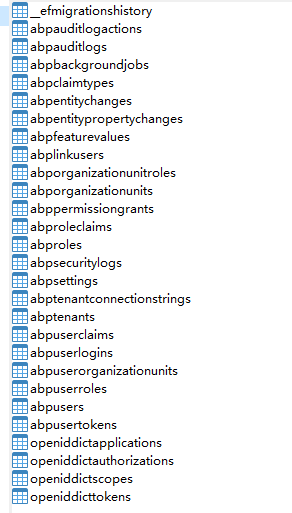
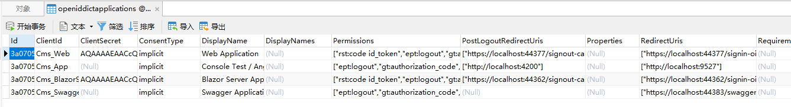

3. 然后就可以启动YiAim.Cms.Web项目（要将它设为启动项目），运行界面如下
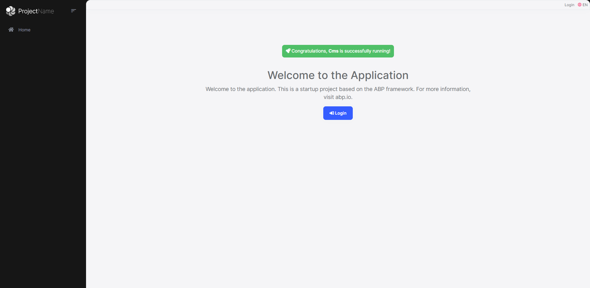
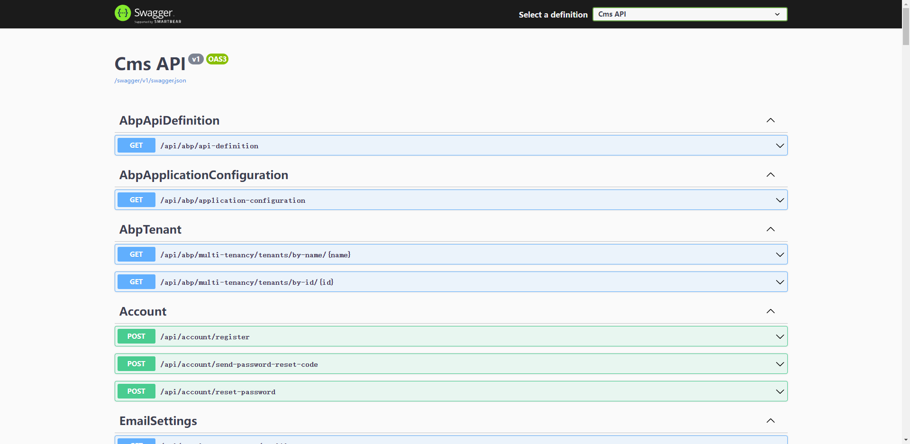

到此abp项目已经能正常运行，本章目标结束。
如果ui端报错需要下章依赖，执行,具体请教百度
```abp install-libs``` 

下章将进行与vue element admin 后台框架的对接，将完成登录、注册等功能。


## 2)对接管理后台的前端vue项目&用户登录

上一章 进行到了让项目跑起来，本章将对接管理后台的前端vue项目&用户登录

项目用到的管理后台UI框架是vue-element-admin vue2版本，下载地址：https://github.com/PanJiaChen/vue-element-admin/tree/i18n

将下载的文件放到，你想放的位置，如
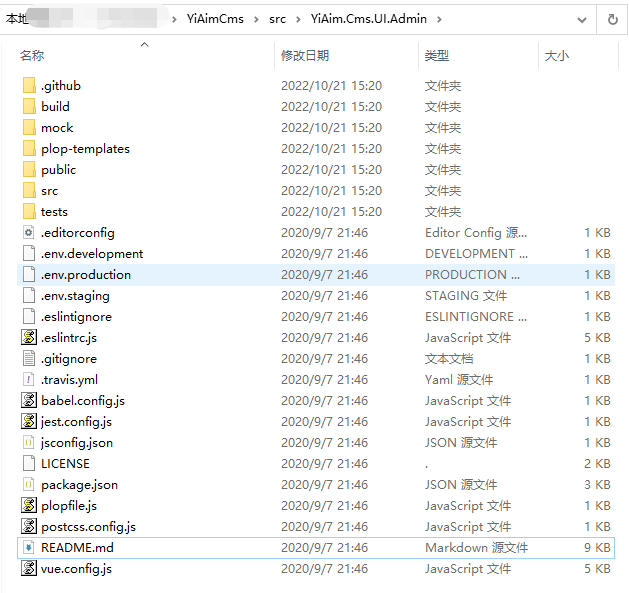

###### 将vue项目跑起来
将项目使用vscode 打开
使用命令先下载依赖环境
` npm install `
运行命令
` npm run dev ` 
如果下载依赖不成功，出现 
>npm ERR! fatal: unable to access ‘https://github.com/nhn/raphael.git/’: OpenSSL SSL_read:错误 

由tui-editor 引起的，解决方法：
1. 先删除 package.json 的 tui-editor 配置项

运行 npm i  或者 yarn install 会正常编译。

2. 在手动安装 tui-editor 

 npm install --save tui-editor

运行成功，如图
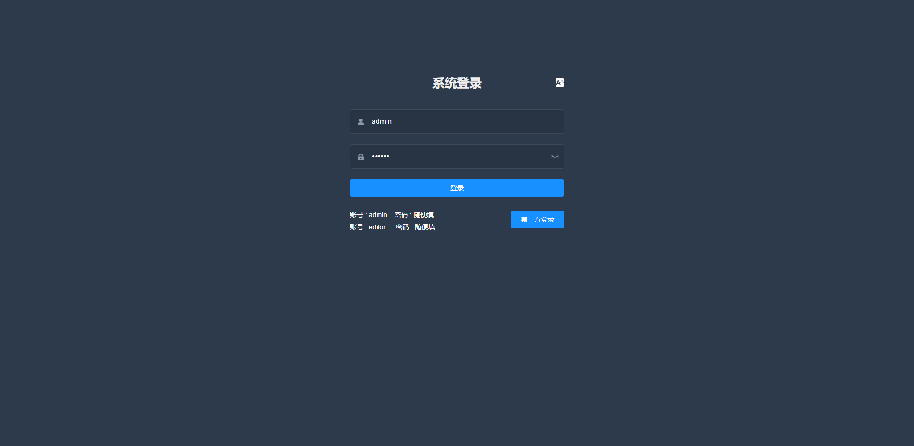

###### 登录相关
接下来，将完成登录相关的功能。

abp框架提供了用户身份验证（identity server ）的相关模块，我们直接使用就行.
可访问 `xxx/.well-known/openid-configuration` 查看

1. 可通过`/connect/token`接口获取获取token 
>(严格来说不应该直接访问/connect/token获取token。首先应该从identityserver发现文档/.well-known/openid-configuration中获取配置信息，然后从/.well-known/jwks 获取公钥等信息用于校验token合法性，最后才是获取token),奈何实力有限先将就着用
2. 前端想正常访问接口需要配置跨域
在xxx.Cms.Web项目的appsetting.json 配置前端的域名
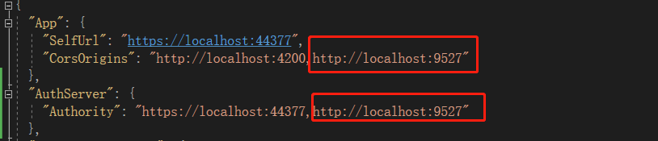
3. xxx.Cms.Web里面在CmsWebModule的ConfigureServices 配置跨域,在OnApplicationInitialization使用 ` app.UseCors(DefaultCorsPolicyName) `
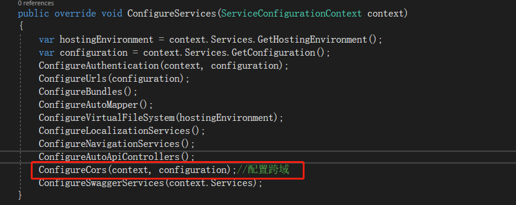
代码如下 
``` 
    private void ConfigureCors(ServiceConfigurationContext context, IConfiguration configuration)
    {
        context.Services.AddCors(options =>
        {
            options.AddPolicy(DefaultCorsPolicyName, builder =>
            {
                builder
                    .WithOrigins(
                        configuration["App:CorsOrigins"]
                            .Split(",", StringSplitOptions.RemoveEmptyEntries)
                            .Select(o => o.RemovePostFix("/"))
                            .ToArray()
                    )
                    .WithAbpExposedHeaders()
                    .SetIsOriginAllowedToAllowWildcardSubdomains()
                    .AllowAnyHeader()
                    .AllowAnyMethod()
                    .AllowCredentials();
            });
        });
    }
```
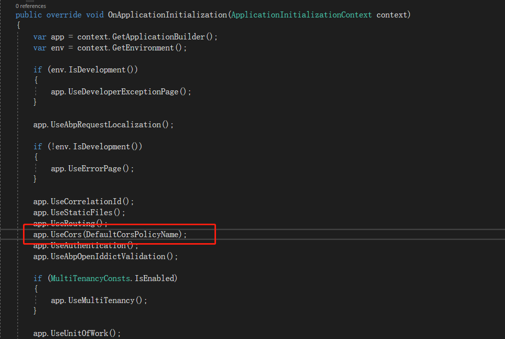

现在可以愉快的调用接口玩耍了~~~
切换vue项目
1. 先将src/utils/request.js 复制一份重命名为abpRequest.js（这里为了不让整个项目的请求报错，后面将删除request.js文件）,将abpRequest.js的baseURL改成 'https://localhost:44377'

2. 在sr/api 里面新建abp.js,内容如下，主要配置abp基本的请求
```
import request from '@/utils/abpRequest'

export function applicationConfiguration() {
  return request({
    url: '/api/abp/application-configuration',
    method: 'get'
  })
}

```
3. 在src/store/modeules/app.js 里面添加abp应用相关的信息获取,getters.js 里面配置

getters.js 
`getters={abpConfig: state => state.app.abpConfig,}`

app.js
```
import { applicationConfiguration } from '@/api/abp'
state = {abpConfig: null,}
mutations={ SET_ABPCONFIG: (state, abpConfig) => {
    state.abpConfig = abpConfig
  }}
  actions={
      applicationConfiguration({ commit }) {
    return new Promise((resolve, reject) => {
      applicationConfiguration()
        .then(response => {
          commit('SET_ABPCONFIG', response)
          const language = response.localization.currentCulture.cultureName
          const values = response.localization.values
          //setLocale(language, values) //设置语言
          resolve(response)
        })
        .catch(error => {
          reject(error)
        })
    })
  },
  }
```
4. 在permission.js 里面添加对获取请求
```
  //在请求之前获取abp应用配置信息
  let abpConfig = store.getters.abpConfig
  if (!abpConfig) {
    abpConfig = await store.dispatch('app/applicationConfiguration')
  }
```
因为我们已经配置了跨域请求，所有能直接正常访问
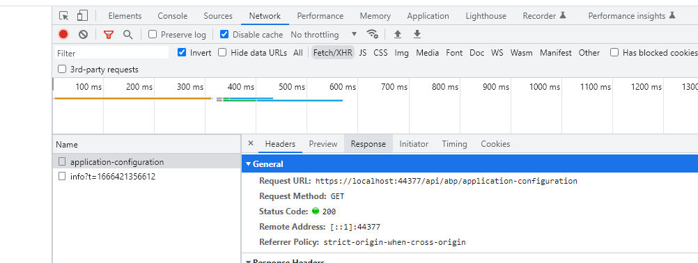
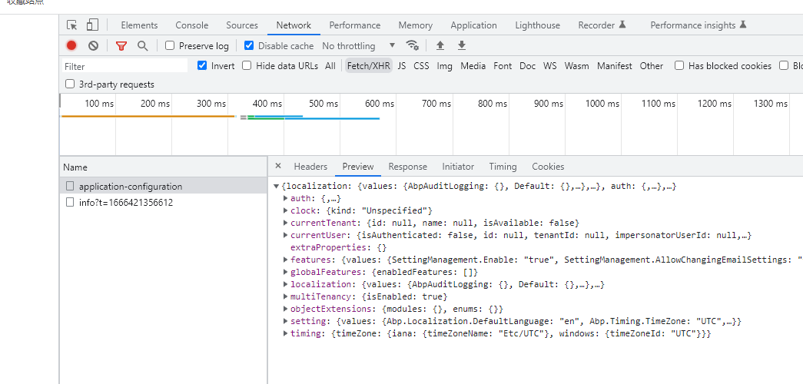

5. 接下来继续改造abpRequest.js，因为没有对返回数据进行处理这时候的界面还是提示报错的
```
import axios from 'axios'
import { MessageBox, Message } from 'element-ui'
import store from '@/store'
const service = axios.create({
  baseURL: 'https://localhost:44377', 
  timeout: 5000 
})
service.interceptors.request.use(
  config => {
    config.headers['accept-language'] = store.getters.language
    if (store.getters.token) {
      config.headers['authorization'] = 'Bearer ' + store.getters.token
    }
    return config
  },
  error => {
    console.log(error) 
    return Promise.reject(error)
  }
)

service.interceptors.response.use(
 
  response => {
    return response.data
  },
  error => {
    if (error.status === 401) {
      MessageBox.confirm(
        '无权限访问',
        '确认注销',
        {
          confirmButtonText: '重新登录',
          cancelButtonText: '取消',
          type: 'warning'
        }
      ).then(() => {
        store.dispatch('user/resetToken').then(() => {
          location.reload()
        })
      })
    }
    let message = ''
    if (error.response && error.response.data && error.response.data.error) {
      message = error.response.data.error.message
    } else {
      message = error.message
    }

    Message({
      message: message,
      type: 'error',
      duration: 5 * 1000
    })
    return Promise.reject(error)
  }
)

export default service

```
5. 解决了基础请求配置的问题，接下来正式进入登录相关
在src/api 建立indentity文件夹(主要用来存放用户身份相关的请求)，新建user.js,里面的接口都是对应swagger里面

src/api/indentity/user/js
```
import request from '@/utils/abpRequest'
import { transformAbpListQuery } from '@/utils/abp'
import qs from 'querystring'

export function login(data) {
  return request({
    url: '/connect/token',
    method: 'post',
    headers: { 'content-type': 'application/x-www-form-urlencoded' },
    data: qs.stringify(data)
  })
}

export function getInfo() {
  return request({
    url: '/api/account/my-profile',
    method: 'get'
  })
}

export function logout() {
  return request({
    url: '/api/account/logout',
    method: 'get'
  })
}


export function getUsers(query) {
  return request({
    url: '/api/identity/users',
    method: 'get',
    params: transformAbpListQuery(query)
  })
}

```
在src/store/modules里的user.js 修改获取token以及获取用户信息等操作

<font color="red">获取token的接口参数要特别注意一下</font>，本人被耗在这里几个小时 ~~ ~

clientSetting里面的参数要从YiAim.Cms.Dbmigrator里面的 appsertting.json里面找
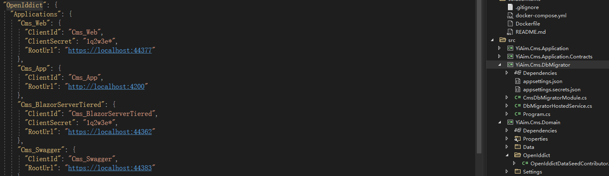
初始化在YiAim.Cms.Domain，具体请看源代码
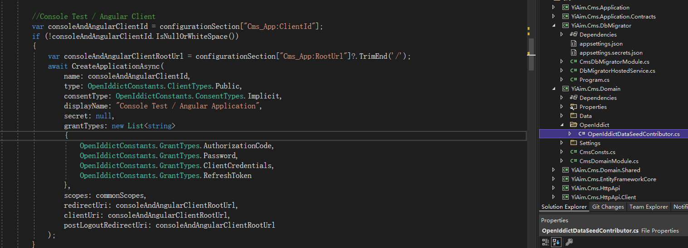
默认初始可以授权的应用有4个
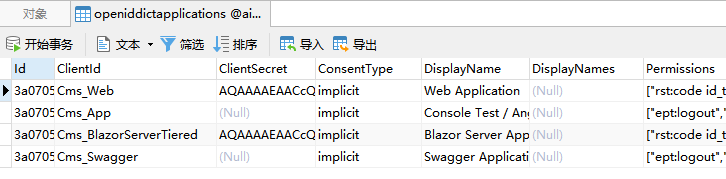
```
login({ commit }, userInfo) {
    const { username, password } = userInfo
    return new Promise((resolve, reject) => {
      const clientSetting = {
        grant_type: "password",
        scope: "Cms",
        username: username.trim(),
        password: password,
        client_id: "Cms_App",
        client_secret: ""
      }
      clientSetting.password="1q2w3E*"
      login(clientSetting).then(response => {
        const token=response.access_token
        commit("SET_TOKEN", token);
        setToken(token).then(()=>{
          resolve()
        })
        
      }).catch(error => {
        reject(error)
      })
    })
```
至此输入账号密码<font color="red">默认账号admin/1q2w3E*</font>  token已能正常获取到！

接下来是获取用户相关的信息，使用接口api/account/my-profile,能正常获取用户信息后发现vue项目并不能跳转

需要我们去去改造一下permission.js里面的内容同时也需要修改一下src/uitls/auth.js

auth.js
```
import Cookies from 'js-cookie'
import store from '@/store'
const TokenKey = 'Admin-Token'

export function getToken() {
  return Cookies.get(TokenKey)
}

export async function setToken(token) {
  const result = Cookies.set(TokenKey, token)
  await store.dispatch('app/applicationConfiguration')
  return result
}

export async function removeToken() {
  const result = Cookies.remove(TokenKey)
  await store.dispatch('app/applicationConfiguration')
  return result
}

```

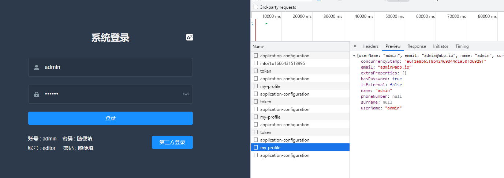


先在permission.js简单处理一下，让我们可以看到效果

> vue-element-admin的菜单权限是使用用户角色来控制的。通过/api/abp/application-configuration接口的auth.grantedPolicies字段，与对应的菜单路由绑定，就可以实现权限控制了。

permission.js
```
router.beforeEach(async(to, from, next) => {
  NProgress.start()
  document.title = getPageTitle(to.meta.title)
  //在请求之前获取abp应用配置信息
  let abpConfig = store.getters.abpConfig
  if (!abpConfig) {
    abpConfig = await store.dispatch('app/applicationConfiguration')
  }
  if (abpConfig.currentUser.isAuthenticated) {
    if (to.path === '/login') {
      next({ path: '/' })
      NProgress.done() 
    } else {
        //主要是这里
      const hasRoles =abpConfig.currentUser.roles||['admin']
      if (hasRoles) {
        next()
      } else {
        try {
          // get user info
          // note: roles must be a object array! such as: ['admin'] or ,['developer','editor']
          const { roles } = await store.dispatch('user/getInfo')

          // generate accessible routes map based on roles
          const accessRoutes = await store.dispatch('permission/generateRoutes', roles)

          // dynamically add accessible routes
          router.addRoutes(accessRoutes)

          // hack method to ensure that addRoutes is complete
          // set the replace: true, so the navigation will not leave a history record
          next({ ...to, replace: true })
        } catch (error) {
          // remove token and go to login page to re-login
          await store.dispatch('user/resetToken')
          Message.error(error || 'Has Error')
          next(`/login?redirect=${to.path}`)
          NProgress.done()
        }
      }
    }
  } else {
    /* has no token*/

    if (whiteList.indexOf(to.path) !== -1) {
      // in the free login whitelist, go directly
      next()
    } else {
      // other pages that do not have permission to access are redirected to the login page.
      next(`/login?redirect=${to.path}`)
      NProgress.done()
    }
  }
})

```
到此，已经能正常进入首页的。
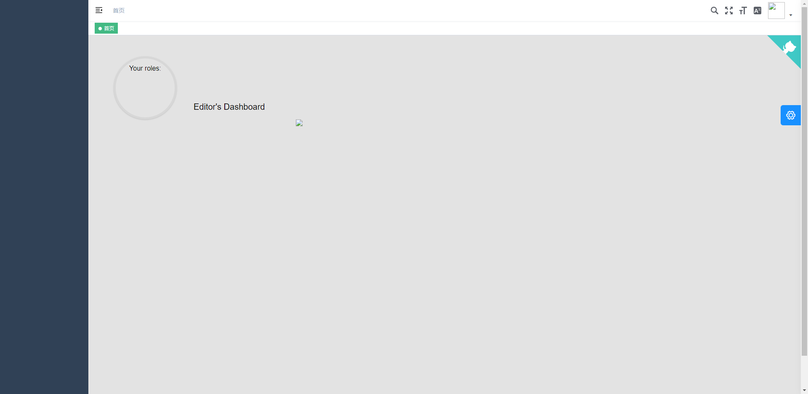

但好像菜单都隐藏了，问题不大下章继续解决，本章到此已经结束，不然篇幅就太长了。本章我们完成了与vue-element-admin的接口对接，完成了登录、应用程序基本初始化功能。
下章将要完成的是菜单权限，注销及其用户头像等信息的补全。

## 3）用户信息&菜单权限管理&vue项目瘦身
上章完成了与vue-element-admin的接口对接，获取token登录的基本功能，本章将继续完成用户信息&菜单权限管理相关功能

> 上章说过vue-element-admin的菜单权限是使用用户角色来控制的，而这里我们不需要通过role控制，通过/api/abp/application-configuration接口的auth.grantedPolicies字段，与对应的菜单路由绑定，进而实现对权限控制。
1. 在src/store/modules/user.js 添加设置roles的方法
```
  setRoles({ commit }, roles) {
    commit("SET_ROLES", roles);
  },
```
2. 在src/store/modules/permission.js修改内容如下：

```
import { asyncRoutes, constantRoutes } from '@/router'

function hasPermission(roles, route) {
  if (route.meta && route.meta.policy) {
    return roles[route.meta.policy]
  } else {
    return true
  }
}

export function filterAsyncRoutes(routes, roles) {
  const res = []
  routes.forEach(route => {
    const tmp = { ...route }
    if (hasPermission(roles, tmp)) {
      if (tmp.children) {
        tmp.children = filterAsyncRoutes(tmp.children, roles)
      }
      if (route.meta && route.meta.policy === '') {
        if (tmp.children.length > 0) {
          res.push(tmp)
        }
      } else {
        res.push(tmp)
      }
    }
  })

  return res
}
const state = {
  routes: [],
  addRoutes: []
}
const mutations = {
  SET_ROUTES: (state, routes) => {
    state.addRoutes = routes
    state.routes = constantRoutes.concat(routes)
  }
}
const actions = {
  generateRoutes({ commit }, roles) {
    return new Promise(resolve => {
      const accessedRoutes = filterAsyncRoutes(asyncRoutes, roles)
      commit('SET_ROUTES', accessedRoutes)
      resolve(accessedRoutes)
    })
  }
}
export default {
  namespaced: true,
  state,
  mutations,
  actions
}

```
3. 在src/permission.js修改内容如下：

```
import router from './router'
import store from './store'
import { Message } from 'element-ui'
import NProgress from 'nprogress' // progress bar
import 'nprogress/nprogress.css' // progress bar style
import getPageTitle from '@/utils/get-page-title'
NProgress.configure({ showSpinner: false }) // NProgress Configuration
const whiteList = ['/login', '/auth-redirect'] // no redirect whitelist
router.beforeEach(async(to, from, next) => {
  NProgress.start()
  document.title = getPageTitle(to.meta.title)
  //在请求之前获取abp应用配置信息
  let abpConfig = store.getters.abpConfig
  if (!abpConfig) {
    abpConfig = await store.dispatch('app/applicationConfiguration')
  }
  if (abpConfig.currentUser.isAuthenticated) {
    if (to.path === '/login') {
      next({ path: '/' })
      NProgress.done() 
    } else {
      if (store.getters.name&&store.getters.token) {
        //登录直接放行
        next()
      } else {
        try {
          //token&&name不存在则重新获取用户信息
         await store.dispatch('user/getInfo')
         await store.dispatch('user/setRoles', abpConfig.currentUser.roles)
         const accessRoutes = await store.dispatch('permission/generateRoutes',abpConfig.auth.grantedPolicies)
         router.addRoutes(accessRoutes)
         next({ ...to, replace: true })
        } catch (error) {
          await store.dispatch('user/resetToken')
          Message.error(error || 'Has Error')
          next(`/login?redirect=${to.path}`)
          NProgress.done()
        }
      }
    }
  } else {
    if (whiteList.indexOf(to.path) !== -1) {
      next()
    } else {
      next(`/login?redirect=${to.path}`)
      NProgress.done()
    }
  }
})

router.afterEach(() => {
  NProgress.done()
})

```
4. 同时要确保user/getInfo 接口能正常获取到用户信息,刷新运行项目就能正常看到菜单
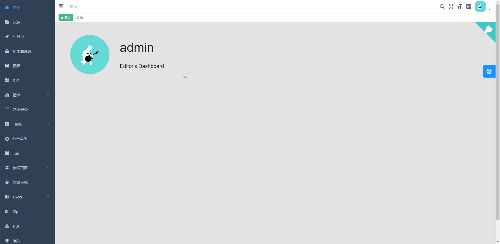

目前的全部菜单并没有被权限控制，需要给路由改造一下
在 src/router/index.js meta里面添加字段 policy: 'AbpIdentity.Roles',<font color="red">AbpIdentity.Roles</font> 为 abppermissiongrants表中的一项，现在将这个删除。(图为已删除结果)
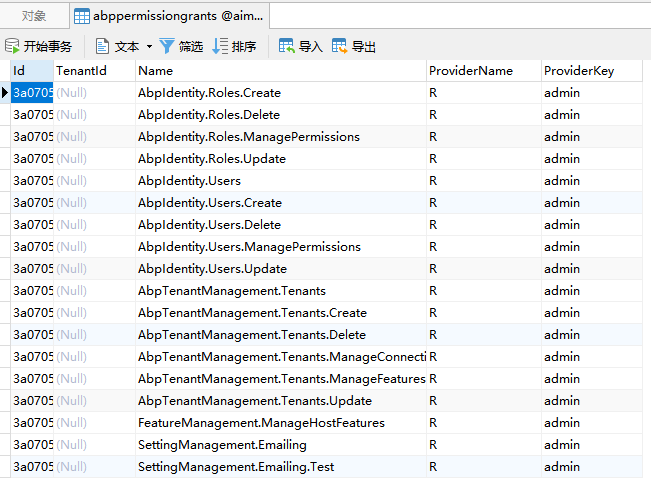

```
export const asyncRoutes = [
  {
    path: '/permission',
    component: Layout,
    redirect: '/permission/page',
    alwaysShow: true, 
    name: 'Permission',
    meta: {
      title: 'permission',
      icon: 'lock',
      policy: 'AbpIdentity.Roles'
    },
    }
  ]
```
> ps:别拿constantRoutes里面的路由测试，这里的路由是公开的不受权限控制

修改完成后重启服务端，刷新ui界面就可以看到"权限测试页"被移除了。
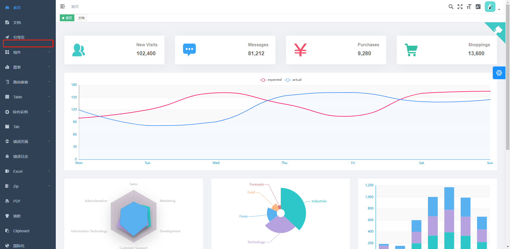

权限绑定菜单到这里就差不多了，接下来是将vue项目瘦身，框架自带的很多东西都不是我们需要的。

。 删除vue里面多余的路由与view
>删除小技巧:根据路由找到相对应的文件夹后删除view，如果某些组件没有用到也可以移除

删除完成后得到的效果
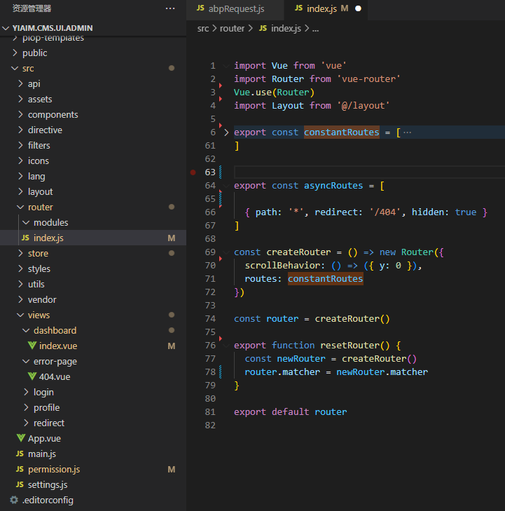
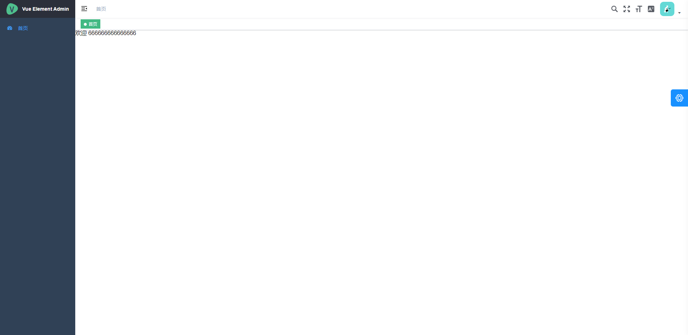

最后添加ABP自带的身份认证模块

在src/touter/modules 添加 identity.js、tenant.js


```
// identity.js
import Layout from "@/layout";

const identityRouter = {
  path: "/identity",
  component: Layout,
  redirect: "noRedirect",
  name: "Identity",
  meta: {
    title: "identity",
    icon: "user"
  },
  children: [
    {
      path: "roles",
      component: () => import("@/views/identity/roles"),
      name: "Roles",
      meta: { title: "roles", policy: "AbpTenantManagement.Tenants" }
    },
    {
      path: "users",
      component: () => import("@/views/identity/users"),
      name: "Users",
      meta: { title: "users", policy: "AbpTenantManagement.Tenants" }
    }
  ]
};
export default identityRouter;
//tenant.js
import Layout from "@/layout";

const tenantRouter = {
  path: "/tenant",
  component: Layout,
  redirect: "/tenant/tenants",
  alwaysShow: true,
  name: "Tenant",
  meta: {
    title: "tenant",
    icon: "tree"
  },
  children: [
    {
      path: "tenants",
      component: () => import("@/views/tenant/index"),
      name: "Tenants",
      meta: { title: "tenants", policy: "AbpTenantManagement.Tenants" }
    }
  ]
};
export default tenantRouter;

```

在src/touter/index.js 里面添加

```
import identityRouter from "./modules/identity";
import tenantRouter from "./modules/tenant";

export const asyncRoutes = [
  identityRouter,
  tenantRouter,
  { path: '*', redirect: '/404', hidden: true }
]

```
在src/views 里面新建identity、tenant文件夹加及相关view

最终展示效果

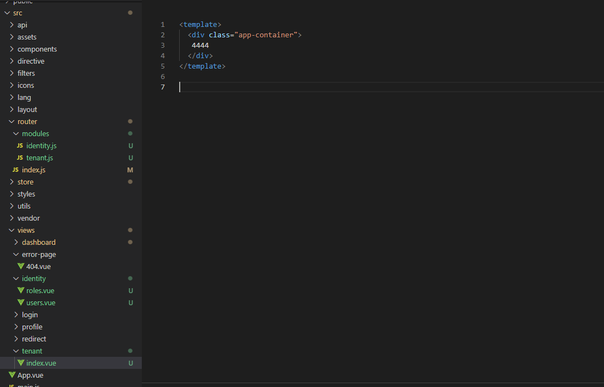

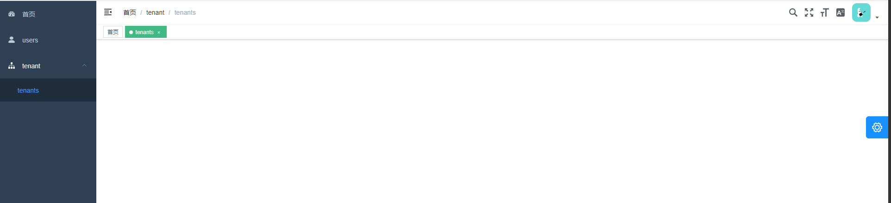

本章到此结束，下章将来继续完成 UI端的权限处理，ABP与vue的国际化

## 4) abp+vue国际化与UI权限管理逻辑处理

> abp与vue国际化形式，这里将采用服务端返回国际化语言的方式实现

先来看一下abp自带的页面，可以看到abp是已经自带了国际化的功能，我们只需要把它搬到vue项目里面就可以。

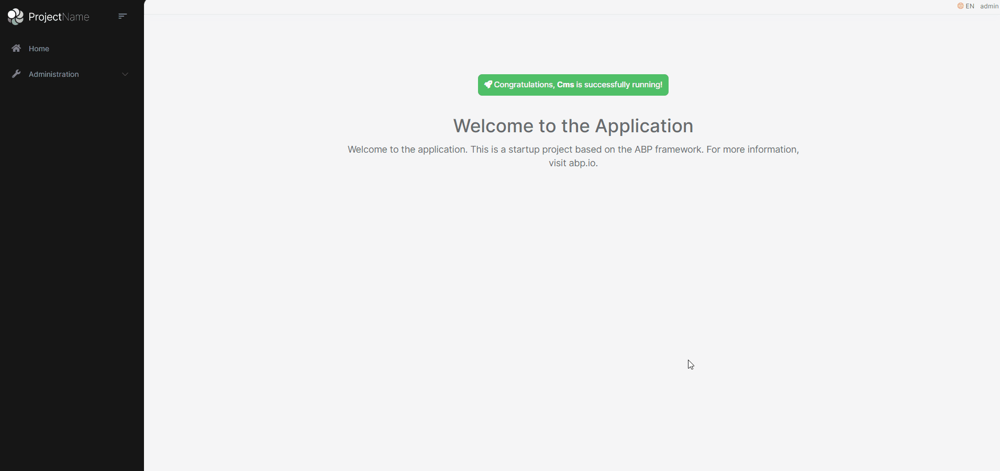

用到的后端接口 `api/abp/application-configuration`

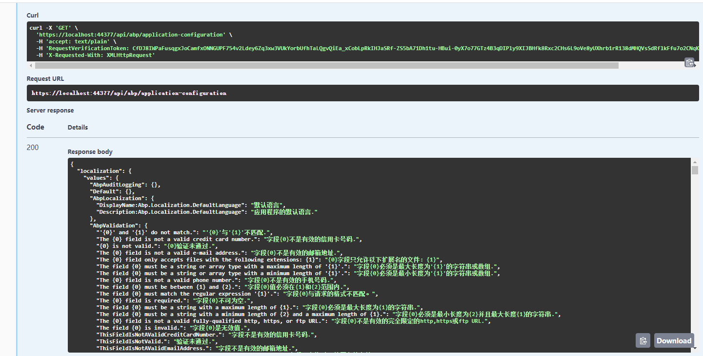

###### 1.下面就来具体实现vue的国际化
application-configuration接口里面提的localization.languages属性只有2个语言了，然后只需要把这个数据绑定到界面上就好了。

- 修改src/lang/index.js同时删除除index.js 以外的js文件
```
import Vue from 'vue'
import VueI18n from 'vue-i18n'
import Cookies from 'js-cookie'
import elementEnLocale from 'element-ui/lib/locale/lang/en' // element-ui lang
import elementZhLocale from 'element-ui/lib/locale/lang/zh-CN'// element-ui lang

Vue.use(VueI18n)

const messages = {
  en: {
    ...elementEnLocale
  },
  'zh-CN': {
    ...elementZhLocale
  }
}

export function setLocale(language, values) {
  i18n.mergeLocaleMessage(language, values)
  i18n.locale = language
}
export function getLanguage() {
  const chooseLanguage = Cookies.get('language')
  if (chooseLanguage) return chooseLanguage
  const language = (
    navigator.language || navigator.browserLanguage
  ).toLowerCase()
  const locales = Object.keys(messages)
  for (const locale of locales) {
    if (language.indexOf(locale) > -1) {
      return locale
    }
  }
  return 'zh-Hans'
}
const i18n = new VueI18n({
  locale: getLanguage(),
  messages
})

export default i18n

```
- 在 src/store/modules/app.js 的 applicationConfiguration 里面添加
```
import { getLanguage,setLocale } from '@/lang/index' 
//根据接口返回设置本地语言
//applicationConfiguration 
setLocale(response.localization.currentCulture.cultureName, response.localization.values)
```
- 语言切换用的是一个公共组件 src\components\LangSelect\index.vue
```
<template>
  <el-dropdown trigger="click" class="international" @command="handleSetLanguage">
    <div>
      <svg-icon class-name="international-icon" icon-class="language" />
    </div>
    <el-dropdown-menu slot="dropdown">
      <el-dropdown-item
        v-for="item in languages"
        :key="item.cultureName"
        :disabled="language === item.cultureName"
        :command="item.cultureName"
      >
        {{ item.displayName }}
      </el-dropdown-item>
    </el-dropdown-menu>
  </el-dropdown>
</template>

<script>
export default {
  data() {
    return {
      languages: this.$store.getters.abpConfig.localization.languages
    }
  },
  computed: {
    language() {
      return this.$store.getters.language
    }
  },
  methods: {
    handleSetLanguage(lang) {
      this.$store.dispatch('app/setLanguage', lang)
      this.$store.dispatch('app/applicationConfiguration').then(() => {
        this.$message({
          message: 'Switch Language Success',
          type: 'success'
        })
      })
    }
  }
}
</script>
```

- 修改后端的配置的语言包文本（src\YiAim.Cms.Domain.Shared\Localization\Cms\zh-Hans.json、zhn-Hans.json）
- 最后在UI界面上对应的文本使用vue-i18n的$t()方法渲染就好了 如：

```
//html
<h3 class="title">{{$t('Cms["Login"]')}} </h3>
//js 里面
this.$i18n.t("AbpAccount['ThisFieldIsRequired.']")

//i18n.js 
export function generateTitle(title) {
  return this.$t(title)
}
// router的路由文件里面
//identity.js

const identityRouter = {
  path: "/identity",
  component: Layout,
  redirect: "noRedirect",
  name: "Identity",
  meta: {
    title: 'AbpIdentity["Menu:IdentityManagement"]',
    icon: "user"
  },
  children: [
    {
      path: "roles",
      component: () => import("@/views/identity/roles"),
      name: "Roles",
      meta: { title: 'AbpIdentity["Roles"]', policy: "AbpIdentity.Roles" }
    },
    {
      path: "users",
      component: () => import("@/views/identity/users"),
      name: "Users",
      meta: { title: 'AbpIdentity["Users"]', policy: "AbpIdentity.Users" }
    }
  ]
};
export default identityRouter;


```

过程可参考【xhznl】大神的文章 https://www.cnblogs.com/xhznl/p/13554571.html

由于项目小且国际化有点繁琐的，要配置的比较多，后面就统一使用中文。
将不再配置i18n对应的字典，有需要的小伙伴可进行配置。

###### 2.UI权限管理逻辑处理
> 身份认证管理模块后端接口都是abp集成的，现阶段就是vue项目里面的接口对接。由于前端部分代码过多，这里就不一一展示，内容参考【xhznl】大神的文章 https://www.cnblogs.com/xhznl/p/13566246.html
或者直接拉起源码

api接口请求全部放在 `src\api\idenity`里面

view放在 `src\views\identity`与 `src\views\tenat`里面

本章到此结束。感谢【xhznl】大神的文章教程，下章将进行内容系统的表，基础接口的搭建。

## 5)内容系统表的搭建&自定义仓储CURD

> 本来是想使用abp的CMS模块但发现里面的东西有点多也不太符合我现有网站的数据结构，有兴趣的小伙伴可下载abp源码看看，里面有很多值得借鉴的地方

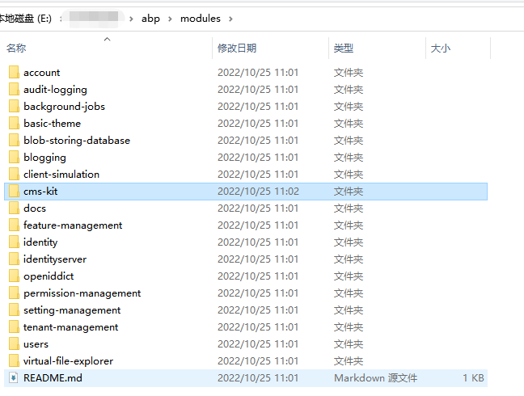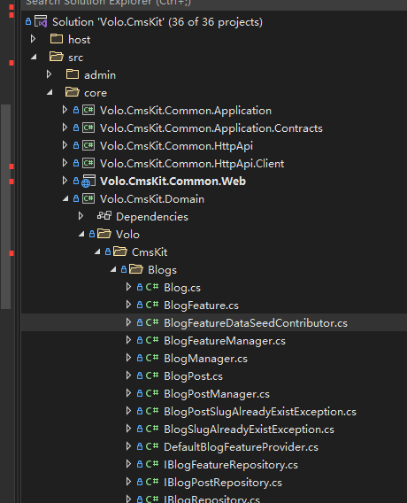

下面列一下个人网站博客框架一些常用的功能(可借鉴abp cms ~)：
- 内容
- 分类
- 标签

- 动态页面
- 轮播图（广告轮播）
- 导航菜单（可有可无）
- 评论 (不需要，后面有空单独做个评论系统的功能)


1. 在 YiAim.Cms.Domain项目新建 Blogs文件夹用于存放所有cms相关的实体表

```
internal interface ITaxis
    {
        /// <summary>
        /// 排序
        /// </summary>
        int Taxis {get;set; }
    }
    public  class TaxisEntity : ITaxis
    {
        /// <summary>
        /// 排序
        /// </summary>
        public virtual int Taxis { get; set; } = 0;
    }
```
- Blog(内容)
```
public class Blog : FullAuditedAggregateRoot<int>, ITaxis
{
    public Blog()
    {
        TagMaps = new HashSet<TagMap>();
    }

    [NotNull]
    [MaxLength(254)]
    public string Title { get; set; }
    [MaxLength(100)]
    public string Author { get; set; }
    /// <summary>
    /// 是否为热点或推荐
    /// </summary>
    public bool IsHot { get; set; } = false;
    /// <summary>
    /// 来源
    /// </summary>
    [MaxLength(150)]
    public string Source { get; set; }

    /// <summary>
    /// 外部链接地址
    /// </summary>
    public string LinkUrl { get; set; }

    /// <summary>
    /// 文章缩略图
    /// </summary>
    public string ThumbImg { get; set; }

    /// <summary>
    /// 审核状态
    /// </summary>
    [NotNull]
    public BlogPostStatus Status { get; set; }

    /// <summary>
    /// 文章摘要
    /// </summary>
    [MaxLength(254)]
    public string Digest { get; set; }
    /// <summary>
    /// 文章内容 已进行编码 ，js 端使用 encodeURIComponent解码
    /// 后端采用System.Web.HttpUtility.UrlDecode(s)解码 / UrlEncoder.Default.Encode(s) 编码
    /// </summary>
    public string Content { get; set; }
    /// <summary>
    /// 发布时间
    /// </summary>
    public long PublishDate { get; set; }
    public int Taxis { get; set; } = 0;

    public int? CategoryId { get; set; }
    public virtual ICollection<TagMap> TagMaps { get; set; }

}
```
- Category（分类）这里允许文章里面分类为空
```
public class Category : FullAuditedAggregateRoot<int>, ITaxis
{
    public Category()
    {
        Blogs = new HashSet<Blog>();
    }
    [NotNull]
    [MaxLength(150)]
    public string Title { get; set; }
    public int Taxis { get; set; } = 0;
    public ICollection<Blog> Blogs { get; set; }
}

```
- Tag 标签
```
public class Tag : FullAuditedAggregateRoot<int>, ITaxis
{
    public Tag()
    {
        TagMaps=new HashSet<TagMap>();
    }
    [NotNull]
    [MaxLength(150)]
    public string Name { get; set; }
    public int Taxis { get; set; } = 0;
    public ICollection<TagMap> TagMaps { get; set; }
}
```
-  TagMap 标签与文章关联表
```
  /// <summary>
    /// 标签与文章关联表
    /// </summary>
    public class TagMap : Entity
    {
        [NotNull]
        public int TagId { get; set; }
        [NotNull]
        public int BlogId { get; set; }
       
        public override object[] GetKeys()
        {
            return new object[] { TagId, TagId };
        }
    }
```
2. 在YiAim.Cms.EntityFrameworkCore\CmsDbContext 里面的 OnModelCreating 方法配置

```
 builder.Entity<Blog>(b =>
        {
            b.ToTable(CmsConsts.CmsDbTablePrefix + "blog", CmsConsts.DbSchema);
            b.ConfigureByConvention();
        });
       
        builder.Entity<Category>(b =>
        {
            b.ToTable(CmsConsts.CmsDbTablePrefix + "category", CmsConsts.DbSchema);
            b.ConfigureByConvention();
        });
        builder.Entity<Tag>(b =>
        {
            b.ToTable(CmsConsts.CmsDbTablePrefix + "tag", CmsConsts.DbSchema);
            b.ConfigureByConvention();
        });

        builder.Entity<TagMap>(b =>
        {
            b.ToTable(CmsConsts.CmsDbTablePrefix + "tag_map", CmsConsts.DbSchema);
            b.HasKey(e => new { e.BlogId, e.TagId });
        });
```
3. 进行数据迁移,生成表如下
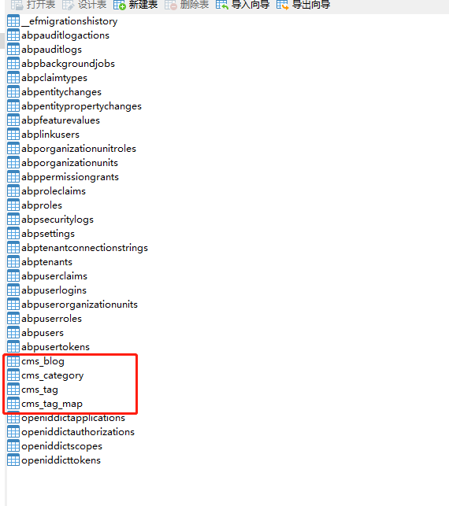

4. 自定义仓储接口
 
 在YiAim.Cms.Domain\Blogs文件夹里面新建IRepositories文件夹用于存放blog相关的自定义仓储
 如：IBlogRepository 继承IBasicRepository或者 IRepository
 > abp框架中已经默认给我们实现了默认的通用(泛型)仓储`IRepository<TEntity, TKey>`，有着标准的CRUD操作，具体可以在：https://docs.abp.io/zh-Hans/abp/latest/Repositories 查看更多
 > 之所以实现自定义仓储是因为有些东西是abp没有给我们，如实现批量插入、更新的方法；（微软官方推荐的EFCore的工具与扩展 https://learn.microsoft.com/zh-cn/ef/core/extensions/）

IBlogRepository.cs
 ```
public interface IBlogRepository : IRepository<Blog, int>
{
    Task BatchInsert(IEnumerable<Blog> blogs);
}
 ```
5. 既然定义了仓储那就实现，不然调用的时候会报错

在YiAim.Cms.EntityFrameworkCore里面新建 Repositories文件夹，里面新建BlogRepository.cs 
使用 EF Core 需要继承 `EfCoreRepository<TDbContext, TEntity, TKey>` 和自定义仓储接口`IXxxRepository`

BlogRepository.cs 
```
public class BlogRepository : EfCoreRepository<CmsDbContext, Blog, int>, IBlogRepository
{
    public BlogRepository(IDbContextProvider<CmsDbContext> dbContextProvider) : base(dbContextProvider)
    {
    }
    public async Task BatchInsert(IEnumerable<Blog> blogs)
    {
        var db = await GetDbContextAsync();
        await db.AddRangeAsync(blogs);
        await db.SaveChangesAsync();
    }
}

```

接下来在就可以在.Application服务层愉快的读取数据了，写服务之前，先分析项目需要哪些功能业务。
由于是个人网站（博客项目），无非就是增删改查，后期对网站进行优化是添加缓存、定时任务之类的功能一个简单的网站差不多就成型了。

6. 在YiAim.Cms.Application.Contracts定义api接口、DTO模型 (DTO就是从我们的领域模型中抽离出来的对象，它只包含我们要拿的数据，不参杂任何行为逻辑)
新建Blogs文件夹，然后再来新建IBlogService继承IApplicationService,里面定义我们业务需要的数据接口
```
public interface IBlogService : IApplicationService
{
    #region 用于后台的接口
    Task Add(AddBlogInput input);
    Task<PagedList<PageBlogDto>> Page(PagingInput requestDto);
    #endregion
}
```
7. 在YiAim.Cms.Application实现接口

新建Blogs文件夹，然后再来新建BlogService继承ApplicationService，IBlogService

```
public class BlogService : ApplicationService, IBlogService
{
    private readonly IBlogRepository _blogRepository;
    public BlogService(IBlogRepository blogRepository)
    {
        _blogRepository = blogRepository;
    }

    public Task Add(AddBlogInput input)
    {
        return Task.FromResult("");
    }
    public async Task<PagedList<PageBlogDto>> Page(PagingInput requestDto)
    {
        PagedList<PageBlogDto> pagedResult = new();
        var items = await _blogRepository.GetPagedListAsync((requestDto.Page-1)*requestDto.Limit, requestDto.Limit, "");
        pagedResult.Items= ObjectMapper.Map<List<Blog>, List<PageBlogDto>>(items);
        return pagedResult;
    }
}
//PagingInput.cs
public class PagingInput : IPageRequestRequest
{
    [Range(1, int.MaxValue)]
    public virtual int Page { get; set; } = 1;
    [Range(1, int.MaxValue)]
    public virtual int Limit { get; set; } = 10;
}
//PagedList.cs
public class PagedList<T> where T : class
{
    public long Count { get; set; }

    public List<T> Items { get; set; }
}

```
8. 测试调用

在Controller中调用，可以直接注入服务的方式实现
如：在 YiAim.Cms.HttpApi ，新建Controller

HelloAbpController.cs 继承 CmsController，CmsController为创建abp项目默认有的一个基类,它里面已经默认继承了abp的基类

```
//CmsController
public abstract  class CmsController : AbpControllerBase
{
    protected CmsController()
    {
        LocalizationResource = typeof(CmsResource);
    }
 
}

public class HelloAbpController : CmsController
{
    private readonly IBlogService _blogService;
    public HelloAbpController(IBlogService blogService)
    {
        _blogService = blogService;
    }
    public async Task<dynamic> Test()
    {
        var result = await _blogService.Page(new PagingInput(1, 10));
        return result;
        // return await Task.FromResult("111");
    }
}

```
然后运行项目，访问 `https://localhost:44377/HelloAbp/test` 就可以看到结果了(前提是你的数据库里面有内容)

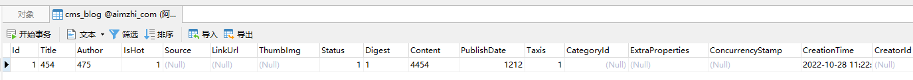

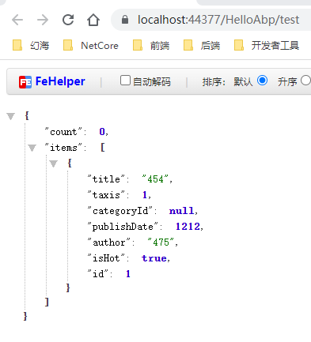

9. 总计
abp的数据访问
- 1.创建实体，完成实体与数据库表的映射关系
- 2.自定义仓储方法及实现对应的读取方法，一般来说使用abp提供的仓储方法已经够小型的项目使用

最后，abp提供了 自动API控制器，不需要我们写controller,直接在服务层配置就可以自动生成api接口，详情请看 https://docs.abp.io/zh-Hans/abp/latest/API/Auto-API-Controllers

后面我们的这个项目也基本使用这种模式开发，减少工作量&也方便测试。

在来看一下 自动api控制器生成的api接口，打开swagger就可以看到对应api,还可以方便测试。

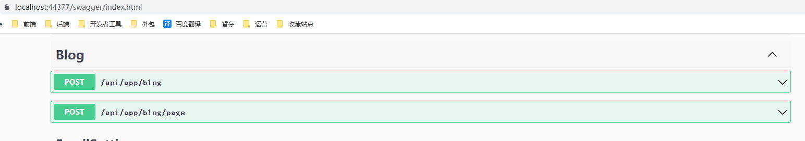

此时整个项目目录结构如下：
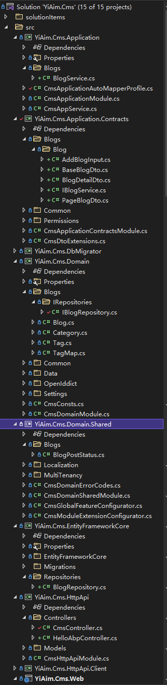

本章已经完成了表的搭建&自定义仓储CURD，Entity Framework Core的数据访问，由于代码太多这里就不全部帖出来，相信各位小伙伴都能完成。
有需要的也可以直接拉取项目。下章我们将对接vue项目完成UI界面的操作。


## 6）vue项目完成blog UI界面逻辑操作

> 现来看一下目前我个人网站实现的管理后台的效果，现这个管理后台也差不多是这个逻辑


- 在utils里面新建grobalMsgTip.js,用于处理页面中出现提示，同时在main.js 中挂载在vue上

robalMsgTip.js

```
import { Message, MessageBox, Loading } from 'element-ui'

const MessageTip = {
    success: function name(msg) {
        Message.success({
            message: msg,
            duration: 2000
        });
    },
    error(msg) {
        Message.error({
            message: msg,
            duration: 2000
        });
    },
    info(msg) {
        Message.info({
            message: msg,
            duration: 2000
        });
    },
    warning(msg) {
        Message.warning({
            message: msg,
            duration: 2000
        });
    },
    delete(succesFn, cancelFn) {
        MessageBox.confirm('此操作将永久删除, 是否继续?', '系统提示', {
            confirmButtonText: '确定',
            cancelButtonText: '取消',
            type: 'warning',
        }).then(() => {
            if (typeof succesFn == "function") {
                succesFn();
            }
        }).catch(() => {
            if (typeof cancelFn == "function") {
                cancelFn();
            }
        });
    },
    loading() {
        return Loading.service({
            lock: true,
            text: "Loading",
            spinner: "el-icon-loading",
            background: "rgba(0, 0, 0, 0.56)",
        })
    }
}
export default {
    MessageTip
}

//main.js
import grobalMsgTip from '@/utils/grobalMsgTip'
Vue.prototype.$mtip = grobalMsgTip.MessageTip
```

- 实现category(分类)

先来看一下后台提供接口,这里直接使用apb提供的CrudAppService【CRUD应用服务】，一个配置完成CRUD的操作，有兴趣可了解一下https://docs.abp.io/zh-Hans/abp/6.0/Application-Services

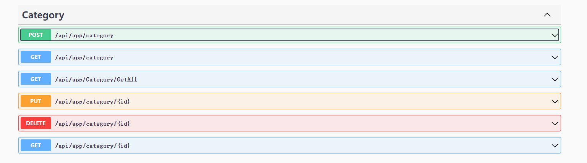

abp都后端代码实现,有一点需要注意的是：我这里有些验证是直接抛出了`UserFriendlyException`异常，UI端做了统一的拦截这样就不需要单独每个请求接口做处理

ps： Dto 不要忘记了在`CmsApplicationAutoMapperProfile`配置映射关系,Dto太多这里就不贴出来了

CategoryService.cs
```
public interface ICategoryService {

    Task<List<CategoryDto>> GetAll();
}

public class CategoryService : CrudAppService<Category, CategoryDto, int, PagingInput, CreateCategoryInput, EditCategoryInput>, ICategoryService
{
    public CategoryService(IRepository<Category, int> repository) : base(repository)
    {
    }
    public override async Task<CategoryDto> CreateAsync(CreateCategoryInput input)
    {
        if (await Repository.AnyAsync(n => n.Title.Equals(input.Title)))
        {
            throw new UserFriendlyException("分类名称已经存在");
        }
        return await base.CreateAsync(input);
    }

    [HttpGet("/api/app/Category/GetAll")]
    
    public async Task<List<CategoryDto>> GetAll()
    {
        var items = await Repository.GetListAsync();
        return ObjectMapper.Map<List<Category>, List<CategoryDto>>(items);
    }
}


```
CmsApplicationAutoMapperProfile.cs
```
public class CmsApplicationAutoMapperProfile : Profile
{
    public CmsApplicationAutoMapperProfile()
    {
        CreateMap<Blog, BaseBlogDto>();
        CreateMap<Blog, BlogDetailDto>();
        CreateMap<Blog, PageBlogDto>();

        CreateMap<Category, BaseCategoryDto>();
        CreateMap<Category, CategoryDto>();

        CreateMap<CreateCategoryInput, Category>().ReverseMap();
        CreateMap<EditCategoryInput, Category>();
    }
}
```

UI端，在src\api\blogs 新建category.js,里面写上我们需要的接口

category.js

```
import request from '@/utils/abpRequest'

import { transformAbpListQuery } from '@/utils/abp'

export function getCategory(query) {
  return request({
    url: '/api/app/category',
    method: 'get',
    params: transformAbpListQuery(query)
  })
}
export function getAllCategory(){
    return request({
        url: '/api/app/Category/GetAll',
        method: 'get',
        params:null
      })
}

export function getCategoryById(id) {
  return request({
    url: `/api/app/category/${id}`,
    method: 'get'
  })
}

export function createCategory(data) {
  return request({
    url: '/api/app/Category',
    method: 'post',
    data
  })
}

export function updateCategory(payload) {
  return request({
    url: `/api/app/category/${payload.id}`,
    method: 'put',
    data: payload
  })
}

export function deleteCategory(id) {
  return request({
    url: `/api/app/category/${id}`,
    method: 'delete'
  })
}

```
UI端，在src\views\cms\category 新建index.vue,为了能界面效果应先配置菜单，在src\router\modules 新建cms.js 配置完内容管理的菜单路由（小技巧：没有新建对应的vue页面的时候可以全部指向一个存在的页面）

cms.js (我这里直接贴已经完成的)
```
import Layout from "@/layout";

const identityRouter = 
    {
        path: '/cms',
        component: Layout,
        redirect: '/cms/blog',
        name: '内容管理',
        meta: { title: '内容管理', icon: 'el-icon-s-help' },
        children: [{
                path: 'blog',
                name: '文章',
                component: () =>
                    import ('@/views/cms/blog/index'),
                meta: { title: '文章', icon: 'table', activeMenu: '/cms/blog' }
            },
            {
                path: 'wxNews',
                name: '公众号文章',
                component: () =>
                    import ('@/views/cms/blog/wxNews'),
                meta: { title: '公众号文章', icon: 'table', activeMenu: '/cms/blog' },
                hidden: true
            },
            {
                path: 'create',
                component: () =>
                    import ('@/views/cms/blog/create'),
                name: 'CreateArticle',
                meta: { title: 'Create Article', icon: 'edit', activeMenu: '/cms/blog' },
                hidden: true
            },
            {
                path: 'edit/:id(\\d+)',
                component: () =>
                    import ('@/views/cms/blog/edit'),
                name: 'EditArticle',
                meta: { title: 'editArticle', noCache: true, activeMenu: '/cms/blog' },
                hidden: true
            },
            {
                path: 'tree',
                name: '分类',
                component: () =>
                    import ('@/views/cms/category/index'),
                meta: { title: '分类', icon: 'tree' }
            },
            {
                path: 'tags',
                name: '标签',
                meta: { title: '标签', icon: 'tree' },
                component: () =>
                    import ('@/views/cms/tag/index'),
                hidden: true
            }
        ]
    };
export default identityRouter;
```

index.vue
```
<template>
  <div class="app-container">
    <div class="filter-container">
      <el-button
        type="primary"
        size="small"
        plain
        @click="showDialog('add')"
        icon="el-icon-edit"
        >新增分类</el-button
      >
    </div>
    <el-table
      v-loading="listLoading"
      :data="columnList"
      element-loading-text="Loading"
      border
      fit
      highlight-current-row
    >
      <el-table-column align="center" label="ID" width="95">
        <template slot-scope="scope">
          {{ scope.row.id }}
        </template>
      </el-table-column>
      <el-table-column label="名称">
        <template slot-scope="scope">
          {{ scope.row.title }}
        </template>
      </el-table-column>
      <el-table-column
        label="操作"
        align="center"
        width="230"
        class-name="small-padding fixed-width"
      >
        <template slot-scope="{ row }">
          <el-button
            type="primary"
            icon="el-icon-edit"
            size="mini"
            @click="updateShowDialog('update', row.id)"
          >
          </el-button>
          <el-button
            v-if="row.status != 'deleted'"
            icon="el-icon-delete"
            size="mini"
            type="danger"
            @click="deleteColumn(row.id)"
          >
          </el-button>
        </template>
      </el-table-column>
    </el-table>
    <el-dialog
      :title="textMap[dialogStatus]"
      :visible.sync="dialogFormVisible"
      width="400px"
    >
      <el-form
        ref="dataForm"
        :rules="rules"
        :model="temp"
        label-position="left"
        label-width="70px"
        style="width: 100%;margin: 0 auto"
      >
        <el-form-item label="名称" prop="title">
          <el-input v-model="temp.title" />
        </el-form-item>
      </el-form>
      <div slot="footer" class="dialog-footer">
        <el-button
          type="primary"
          size="small"
          @click="dialogStatus === 'add' ? createData() : updateData()"
        >
          确认
        </el-button>
        <el-button size="small" @click="dialogFormVisible = false">
          取消
        </el-button>
      </div>
    </el-dialog>
  </div>
</template>

<script>
import {
  createCategory,
  deleteCategory,
  updateCategory,
  getAllCategory
} from "@/api/blogs/category";
export default {
  filters: {
    statusFilter(status) {
      const statusMap = {
        published: "success",
        draft: "gray",
        deleted: "danger",
      };
      return statusMap[status];
    },
  },
  data() {
    return {
      listLoading: true,
      dialogFormVisible: false,
      temp: {
        title: "",
        taxis:0
      },
      textMap: {
        update: "编辑",
        add: "添加",
      },
      dialogStatus: "",
      rules: {
        title: [
          {
            required: true,
            message: "分类名称不能为空",
            trigger: "blur",
          },
        ],
      },
      columnList: [],
      value: "",
    };
  },
  created() {
    this.getColumnList();
  },
  methods: {
    getColumnList() {
      this.listLoading = true;
      getAllCategory()
        .then((res) => {
          this.columnList = res;
          this.listLoading = false;
        })
        .catch(() => {
          this.listLoading = false;
        });
    },
    updateShowDialog(type, id) {
      this.temp = this.columnList.filter((n) => n.id == id)[0];
      this.showDialog(type);
    },
    showDialog(type) {
      if (type == "add") {
        this.resetTemp();
      }
      this.dialogStatus = type;
      this.dialogFormVisible = true;
      this.$nextTick(() => {
        this.$refs["dataForm"].clearValidate();
      });
    },
    createData() {
      this.$refs["dataForm"].validate((valid) => {
        if (valid) {
          createCategory(this.temp).then((res) => {
              this.getColumnList()
              this.dialogFormVisible = false
              this.$mtip.success("添加成功")
            })
            .catch((res) => {
              this.dialogFormVisible = false
            });
        }
      });
    },
    updateData() {
      this.$refs["dataForm"].validate((valid) => {
        if (valid) {
          updateCategory(this.temp)
            .then((res) => {
              this.dialogFormVisible = false
              this.resetTemp()
              this.$mtip.success("修改成功")
            })
            .catch(() => {
              this.dialogFormVisible = false
            });
        }
      });
    },
    resetTemp() {
      this.temp = {
        id: undefined,
        title: "",
         taxis:0
      };
    },
    deleteColumn(id) {
      this.$mtip.delete(() => {
        deleteCategory(id)
          .then((res) => {
            this.getColumnList()
            this.$mtip.success("删除成功");
          })
      })
    },
  },
};
</script>

```

最后，确保你的api能正常访问就能得到下面的效果

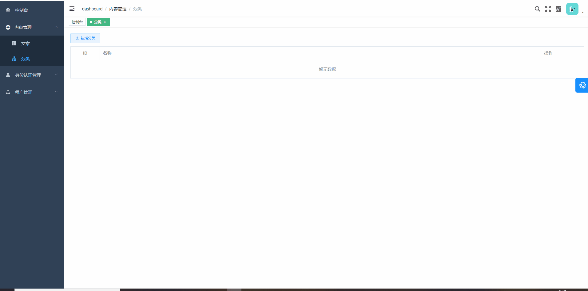

> 内容管理的标签这个功能，这里就不贴出来了。它跟分类差不多的实现逻辑，标签的列表里面不需要添加功能，因为添加功能在添加文章的时候实现的。还有分类呢这里不使用分页，因为分类不会有很多，有需要的也可以自己添加上去。

至此，本章已经完成了UI端的内容管理里面的分类、标签的相关功能，下章将来完成文章相关的部分内容。

## 7) 文章管理&vue2富文本百度编辑器（UEditor）支持

一个内容系统自然离不开富文本编辑器的支持，这里选择了老牌的百度编辑器（UEditor）作为用户内容输入的控件。个人多年下来也习惯它的风格与功能也认为UEditor是非常棒的富文本编辑器。虽然目前已经很少再更新了，但也不妨碍我们使用。


1. 下载UEditor包后 在`public`将UEditor放到这个目录
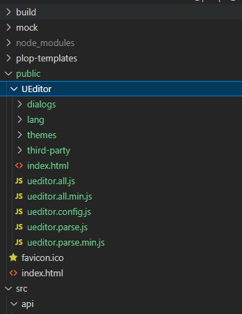

2. vue里面还需要下章vue-ueditor-wrap组件 https://github.com/HaoChuan9421/vue-ueditor-wrap/tree/2.x 【一个“包装”了 UEditor 的 Vue 组件，支持通过 v-model 来绑定富文本编辑器的内容，让 UEditor 的使用简单到像 Input 框一样。】 

Installation
```
# vue-ueditor-wrap v2 仅支持 Vue 2
npm i vue-ueditor-wrap@2.x
# 或者
yarn add vue-ueditor-wrap@2.x
```

3. 服务端将使用 UEditor.Core 对 UEditor 文件上传支持【https://github.com/fangjun953322/UEditor.Core】

在`YiAim.Cms.HttpApi`安装`UEditor.Core`包依赖
将UEditor项目里面的config.json复制到`YiAim.Cms.Web`里面并重命名为`uEditorConfig.json`同时将文件设为可复制
在`YiAim.Cms.HttpApi`的CmsHttpApiModule.cs 注入UEditor的服务

```
 public override void ConfigureServices(ServiceConfigurationContext context)
    {
        var _services = context.Services;
        _services.AddUEditorService(configFileRelativePath: "uEditorConfig.json", isCacheConfig: false, basePath: "");
        ConfigureLocalization();
    }
```
4. 将blog里面的curd方法补全同时确保api能正常访问，这里将文章分类设为可空（本人项目需求）

> 需要注意的是添加、修改文章的时候要用事务，确保文章、标签、文章标签关联的数据能一起保存
> 这里使用abp自动生成的crud时，对于添加文章来说很明显是不能满足我们的业务需求的，所有这里选择了重写，按照满足业务需求的方式进行实现，同时采用 ABP框架的工作单元(UOW) 实现事务控制 【https://docs.abp.io/zh-Hans/abp/6.0/Unit-Of-Work】

Category.cs 改为
```
public class Category : FullAuditedAggregateRoot<int>, ITaxis
{
    //public Category()
    //{
    //    Blogs = new HashSet<Blog>();
    //}
    [NotNull]
    [MaxLength(150)]
    public string Title { get; set; }
    public int Taxis { get; set; } = 0;
   // public ICollection<Blog> Blogs { get; set; }
}

//blog里面 CategoryId设为可空
public int? CategoryId { get; set; }
```
进行数据迁移，重新生成表结构。这是blog表已经移除了外键关联

IBlogService.cs
```
public interface IBlogService :ICrudAppService<BlogDetailDto, PageBlogDto, int, PagingInput, CreateBlogInput, UpdateBlogInput>
{
   
}
```
BlogService.cs
```
public class BlogService : CrudAppService<Blog, BlogDetailDto, PageBlogDto, int, PagingInput, CreateBlogInput, UpdateBlogInput>, IBlogService
{
    private readonly IRepository<Category, int> _categoryRepository;
    private readonly IRepository<Tag, int> _tagRepository;
    private readonly IRepository<TagMap> _tagMapRepository;
    public BlogService(
        IRepository<Category, int> categoryRepository,
        IRepository<Tag, int> tagRepository,
        IRepository<TagMap> tagMapRepository,
        IRepository<Blog, int> repository) : base(repository)
    {
        _tagRepository = tagRepository;
        _tagMapRepository = tagMapRepository;
        _categoryRepository = categoryRepository;
    }
    [HttpPost("/api/app/blog/UpdateTaxis")]
    public async Task UpdateTaxis(UpdateBlogCategoryInput input)
    {
        if (!(await _categoryRepository.AnyAsync(n => n.Id == input.ColumnId)))
        {
            throw new UserFriendlyException("分类不存在");
        }
        var blog = await Repository.FirstOrDefaultAsync(n => n.Id == input.NewsId);
        if (blog is null)
        {
            throw new UserFriendlyException("文章不存在");
        }
        blog.CategoryId = input.ColumnId;
        await Repository.UpdateAsync(blog);
    }

    [UnitOfWork]
    public async override Task<BlogDetailDto> CreateAsync(CreateBlogInput input)
    {
        List<Tag> tags = new();
        if (!string.IsNullOrWhiteSpace(input.Tags))
        {
            foreach (string tagStr in input.Tags.Split(','))
            {
                Tag tag = await _tagRepository.FirstOrDefaultAsync(n => n.Name.Equals(tagStr));
                if (tag is null)
                {
                    tag = new Tag
                    {
                        Name = tagStr,
                        Taxis = 0,
                    };
                    await _tagRepository.InsertAsync(tag, true);
                }
                tags.Add(tag);
            }
        }
        if (string.IsNullOrWhiteSpace(input.Digest))
        {
            string desc = "";
            //RichTextHtmlHelper.ReplaceAllTag(input.Content);
            if (desc.Length > 200)
                desc = desc.Substring(0, desc.Length - 1);
            input.Digest = desc;
        }
        //编码存入数据库
        input.Content = UrlEncoder.Default.Encode(input.Content);
        Blog blog = await Repository.InsertAsync(ObjectMapper.Map<CreateBlogInput, Blog>(input),true);
        if (tags.Count > 0)
        {
            List<TagMap> articleTags = new();
            tags.ForEach(tag =>
            {
                articleTags.Add(new TagMap { BlogId = blog.Id, TagId = tag.Id });
            });
           await _tagMapRepository.InsertManyAsync(articleTags);
        }
        return ObjectMapper.Map<Blog, BlogDetailDto>(blog);
    }
}

```
访问swagger 可以看到blog与UEditor的api都是正常的


5. 回到vue里面，在 src\api\blogs\blog.js里面补全blog接口请求

blog.js
```
import request from '@/utils/abpRequest'

import { transformAbpListQuery } from '@/utils/abp'

export function getPage(query) {
  return request({
    url: '/api/app/blog',
    method: 'get',
    params: transformAbpListQuery(query)
  })
}

export function getBlogById(id) {
  return request({
    url: `/api/app/blog/${id}`,
    method: 'get'
  })
}

export function createBlog(data) {
  return request({
    url: '/api/app/blog',
    method: 'post',
    data
  })
}

export function updateBlog(payload) {
  return request({
    url: `/api/app/blog/${payload.id}`,
    method: 'put',
    data: payload
  })
}

export function deleteBlog(id) {
  return request({
    url: `/api/app/blog/${id}`,
    method: 'delete'
  })
}

```
在 src\views\cms\blog文件夹里面，创建index.vue 列表页、edit.vue编辑页、create.vue创建页，不管是创建还是编辑本质都是from表单，所有把用户输入的表单抽出成为一个公共组件，新建components文件夹里面，新建ArticleFromDetail.vue

index.vue
```
<template>
  <div class="app-container">
    <div class="filter-container">
      <el-button
        type="primary"
        size="small"
        plain
        @click="handleCreate"
        icon="el-icon-edit"
        >添加文章</el-button
      >
      <el-button
        type="primary"
        size="small"
        plain
        @click="addWxNews"
        icon="el-icon-edit"
        >添加公众号文章</el-button
      >
      <el-button
        type="warning"
        size="small"
        icon="el-icon-delete"
        @click="handleMultiDel"
        >批量删除</el-button
      >
    </div>
    <el-table
      v-loading="listLoading"
      :data="list"
      element-loading-text="Loading"
      border
      fit
      highlight-current-row
      @selection-change="selsChange"
    >
      <el-table-column type="selection" width="40"></el-table-column>

      <!-- <el-table-column label="缩略图" width="200px" align="center">
        <template slot-scope="{ row }">
          <span v-if="row.thumImg == ''">无</span>
          <div v-else>
            <div v-if="row.isWx" class="bg_thumb bg_thumb_wx">
               -1"
                :src="'/api/file/showbase64/' + encodeURIComponent(row.thumImg)"
              />
              
            </div>
            <div v-else class="bg_thumb">
              
            </div>
          </div>
        </template>
      </el-table-column> -->

      <el-table-column label="标题" min-width="150px">
        <template slot-scope="{ row }">
          <span class="link-type">{{ row.title }}</span>
        </template>
      </el-table-column>
      <el-table-column label="分类" width="110px" align="center">
        <template slot-scope="scope">
          <span class="link-type" @click="showDialog(scope.row.id)"
            >{{getCatTitle(scope.row.categoryId)}}
            <i class="el-icon el-icon-edit"></i
          ></span>
        </template>
      </el-table-column>
      <el-table-column label="作者" width="80px" align="center">
        <template slot-scope="{ row }">
          <span>{{ row.author }}</span>
        </template>
      </el-table-column>
      <el-table-column label="排序" width="80px" align="center">
        <template slot-scope="{ row }">
          <span>{{ row.taxis }}</span>
        </template>
      </el-table-column>

      <!-- <el-table-column label="添加时间" width="100px" align="center">
        <template slot-scope="scope">
          <span>{{ scope.row.addTime | parseTime("{m}-{d} {h}:{i}") }}</span>
        </template>
      </el-table-column> -->
      <el-table-column
        label="操作"
        align="center"
        class-name="small-padding fixed-width"
        width="150px"
      >
        <template slot-scope="{ row }">
          <el-button
            type="primary"
            icon="el-icon-edit"
            size="mini"
            title="编辑"
            @click="handleUpdate(row.id)"
          >
          </el-button>
          <el-button
            type="success"
            size="mini"
            title="更换封面"
            icon="el-icon-picture-outline"
            @click="upArticleThumb(row.id)"
          >
          </el-button>
          <el-button
            v-if="row.status != 'deleted'"
            icon="el-icon-delete"
            size="mini"
            type="danger"
            title="删除"
            @click="handleDelete(row.id)"
          >
          </el-button>
        </template>
      </el-table-column>
    </el-table>
    <pagination
      v-show="total > 0"
      :total="total"
      :page.sync="listQuery.page"
      :limit.sync="listQuery.limit"
      @pagination="getList"
    />

    <el-dialog
      title="选项归属分类"
      :visible.sync="dialogFormVisible"
      width="400px"
    >
      <el-form>
        <el-form-item label="分类">
          <el-select placeholder="请选择" v-model="currentChooseCat">
            <el-option
              v-for="item in columnList"
              :key="item.id"
              :label="item.title"
              :value="item.id"
            >
            </el-option>
          </el-select>
        </el-form-item>
      </el-form>
      <div slot="footer" class="dialog-footer">
        <el-button type="primary" size="small" @click="editCat()">
          确认
        </el-button>
        <el-button size="small" @click="dialogFormVisible = false">
          取消
        </el-button>
      </div>
    </el-dialog>
    <!-- <image-cropper
      ref="imagecropper"
      :options="cropperOptions"
      :imgSize="3"
      :imgType="imgType"
      :imageUrl="imgUrl"
      @crop-upload-close="cropClose"
      @crop-upload-success="cropSuccess"
    /> -->
  </div>
</template>

<script>
import waves from "@/directive/waves";
import Pagination from "@/components/Pagination";
import { getPage, updateTaxis } from "@/api/blogs/blog";
import { getAllCategory } from "@/api/blogs/category";
import ImageCropper from "@/components/ImageCropper";
export default {
  name: "ComplexTable",
  components: { Pagination, ImageCropper },

  directives: { waves },
  data() {
    return {
      total: 0,
      list: null,
      listLoading: true,
      listQuery: {
        page: 1,
        limit: 10,
      },
      sels: [],
      dialogFormVisible: false,
      currentChooseCat: 0,
      columnList: [],
      currentChooseArticleId: null,
      cropperOptions: {
        autoCrop: true, //是否默认生成截图框
        autoCropWidth: 554, //默认生成截图框宽度
        autoCropHeight: 236, //默认生成截图框高度
        fixedNumber: [2.35, 1],
        fixedBox: false,
        canScale: false,
        fiexd: true,
        full: true,
        infoTrue: false,
        centerBox: true, //截图框是否被限制在图片里面
        previewsCircle: false, //预览图是否是圆形
        title: "上传封面",
      },
      imgType: "testUp",
      imgUrl: "",
      currentEditArticleId: null,
    };
  },
  created() {
    Promise.all([getAllCategory(), this.getList()]).then((res) => {
      let cates = res[0];
      if (cates != null) {
        this.columnList=cates
      }
    });
  },
  methods: {
    upArticleThumb(id) {
      this.currentEditArticleId = id;
      this.$refs.imagecropper.clickShowUpload();
    },

    //上传操作结束
    cropClose() {
      console.log("上传操作结束");
    },
    //上传图片成功
    cropSuccess(data, callback) {
      console.log(data, "上传图片成功");
      if (this.currentEditArticleId != null) {
        article
          .updateThumb({ id: this.currentEditArticleId, path: data.fileUrl })
          .then((res) => {
            callback(false);
            if (res.success) {
              let currentArticle = this.list.filter(
                (n) => n.id == this.currentEditArticleId
              )[0];
              currentArticle.thumImg = data.fileUrl;
              this.$mtip.success(res.message);
            } else {
              this.$mtip.error(res.message);
            }
          })
          .catch((error) => {
            callback(false);
          });
      } else {
        callback(false);
      }
    },

    addWxNews() {
      this.$router.push({ path: "/cms/wxNews" });
    },
    getList() {
      this.listLoading = true;
      getPage(this.listQuery).then((response) => {
        this.list = response.items;
        this.total = response.totalCount;
        this.listLoading = false;
      });
    },
    selsChange(sels) {
      var ids = [];
      sels.forEach((item) => {
        ids.push(item.id);
      });
      this.sels = ids;
    },
    handleMultiDel() {
      if (this.sels.length < 1) {
        this.$message.info("请选择要删除的项！");
      }
      let loading = this.$mtip.loading();
      article
        .batchDelete(this.sels.join(","))
        .then((res) => {
          res.success
            ? this.$mtip.success(res.message)
            : this.$mtip.error(res.message);
          this.getList();
          loading.close();
        })
        .catch((error) => {
          loading.close();
        });
    },
    handleCreate() {
      this.$router.push({ path: "/cms/create" });
    },
    handleUpdate(id) {
      this.$router.push({ path: "/cms/edit/" + id });
    },
    handleDelete(row) {
      var _this = this;
      this.$mtip.delete(() => {
        let loading = this.$mtip.loading();
        article
          .delete(row)
          .then((res) => {
            res.success
              ? this.$message.success("删除成功")
              : this.$message.error(res.message);
            _this.getList();
            loading.close();
          })
          .catch((error) => {
            loading.close();
          });
      });
    },
    showDialog(id) {
      this.currentChooseArticleId = id;
      this.currentChooseCat = this.list.filter((n) => n.id == id)[0].categoryId;
      let loading = this.$mtip.loading();
      if (this.currentChooseCat == undefined) {
         this.currentChooseCat = this.columnList[0].id;
      }
      loading.close();
      this.dialogFormVisible = true;
    },
    editCat() {
      if (this.currentChooseArticleId != null) {
        let loading = this.$mtip.loading();
        updateTaxis(this.currentChooseArticleId, this.currentChooseCat)
          .then((res) => {
            let currentArticle = this.list.filter(
              (n) => n.id == this.currentChooseArticleId
            )[0];
            let curCat = this.columnList.filter(
              (n) => n.id == this.currentChooseCat
            )[0];
            currentArticle.categoryId = curCat.id;
            this.$mtip.success("更新成功");
            this.dialogFormVisible = false;
            loading.close();
          })
          .catch((error) => {
            console.log(error);
            loading.close();
          });
      }
    },
    getCatTitle(id){
        let index=this.columnList.findIndex(n=>n.id==id);
        if(this.columnList.findIndex(n=>n.id==id)>-1){
            return this.columnList[index].title
        }
        return "无"
    }
  },
};
</script>
<style scoped>
.fixed-width .el-button--mini {
  padding: 7px 10px;
  min-width: 30px;
}

</style>

```

create.vue
```
<template>
  <article-detail :is-edit="false" />
</template>

<script>
import ArticleDetail from './components/ArticleFromDetail'

export default {
  name: 'CreateArticle',
  components: { ArticleDetail }
}
</script>
```

edit.vue
```
<template>
  <article-detail :is-edit="true" />
</template>

<script>
import ArticleDetail from './components/ArticleFromDetail'

export default {
  name: 'EditForm',
  components: { ArticleDetail }
}
</script>

```
- ArticleFromDetail.vue 文件里面为了防止代码过多、方便管理，我们将js、css 都单独抽离出来

articleEdit.js 放在 src\assets\js里面
```
import { getBlogById, createBlog, updateBlog } from "@/api/blogs/blog";
import { getAllCategory, getCategoryById } from "@/api/blogs/category";

import ueditor from "vue-ueditor-wrap";
import htmlFormat from "../../utils/htmlFormatHelper";
export default {
  components: {
    ueditor,
  },
  data() {
    return {
      isShowEdit: false,
      isEditorInit:false,
      titleMaxLen: 120,
      descMaxLen: 160,
      isTitleWordCount: false,
      isAuthorWordCount: false,
      categories:[],
      confirmLoading: false,
      publishDate: new Date(),
      article: {id: 0,
        categoryId: 0,
        title: "",
        author: "",
        source: "",
        linkUrl: "",
        taxis: 0,
        thumbImg: "",
        status: 0,
        digest: "",
        content: "",
        tags: "",
        publishDate: ""},
      editorConfig: "",
      editorDependencies: [
        "ueditor.config.js",
        "ueditor.all.js",
        "ueditor.parse.js",
      ],
      isEdit: false,
      dynamicTags: [],
      inputVisible: false,
      inputValue: "",
      uploadLoading: false,
      isShowContentTip: true,
      thumbList: [],
      submitTxts: ["发布", "提交修改"],
      articleImgvisible: false,
      currentContentImgs: [],
      currentContentImgIndex: -1,
      formatVisible: false,
      checkedList: [],
      plainOptions: [
        "所有标签",
        "注释",
        "多余空格",
        "所有标签属性（不含img）",
        "img（保留src）",
        "a(保留内容)",
        "换行",
        "video",
        "form",
        "iframe",
        "style",
        "script",
        "标签class",
        "标签style",
      ],
      formatRichLableInput: "",
      //替换的标签或正则表达式
      replaceLableRegexInput: "",
      //替换的内容
      replaceRichInput: "",
    };
  },
  created() {
    this.showTemplList = [];
    this.confirmLoading = true;
    this.initEditor();
    Promise.all([getAllCategory(), this.getArticle(0)])
    .then((res) => {
      this.categories = res[0];
      if(this.categories.length>0){
        this.article.categoryId=this.categories[0].id
      }
      if (res[1] != null) {
        let detail = res[1];
        this.article = detail;
        this.article.content = decodeURIComponent(this.article.content);
        if (detail.thumbImg != "") {
          var index = 0;
          var vv = [];
          for (var img of detail.thumbImg.split("|")) {
            index++;
            vv.push({
              uid: index + "",
              name: img,
              status: "done",
              url: img,
              thumbUrl: img,
            });
          }
          this.thumbList = vv;
        }
        // if (detail.articleTags != null) {
        //   for (var item of detail.articleTags) {
        //     this.dynamicTags.push(item.tag.name);
        //   }
        // }
      } 
      this.confirmLoading = false;
    })
    .finally( ()=> {
      this.confirmLoading = false;
    });
  },
  computed: {
    calcDescLength() {
      return this.article.digest == undefined ? 0 : this.article.digest.length;
    },
    calcTitleLength() {
      return this.article.title == undefined ? 0 : this.article.title.length;
    },
    calcAuthorLength() {
      return this.article.author == undefined ? 0 : this.article.author.length;
    },
  },
  mounted() {
    //监听滚动条
    window.addEventListener("scroll", this.scrolling);
  },

  beforeDestroy() {},
  watch: {
    "article.content"(newValue, oldValue) {
      this.isShowContentTip =
        newValue == undefined ? false : newValue.length === 0;
    },
  },
  methods: {
    scrolling() {
     //动态设置编辑器工具栏的距离顶部的位置，主要是使用js控制css变量（--topBar）
      let scrollTop =
        window.pageYOffset ||
        document.documentElement.scrollTop ||
        document.body.scrollTop;
        let t=82-scrollTop
        document.documentElement.style.setProperty('--topBar',(t>0?t:0)+'px')
    },
    titleFocus() {
      this.isTitleWordCount = true;
    },
    blur() {
      if (this.article.title.length <= this.titleMaxLen) {
         this.isTitleWordCount = false;
      }
      if (this.article.author.length <= 8) {
        this.isAuthorWordCount = false;
      }
    },
    getArticle(id) {
      if (this.isEdit) {
        return getCategoryById(id);
      } else {
        return new Promise((resolve, reject) => {
          resolve(null);
        });
      }
    },
    removeFile(file) {
      this.thumbList = this.thumbList.filter((n) => n.uid != file.uid);
    },
    /**文件上传相关 start */
    beforeUpload(file) {
      const isJpgOrPng =
        file.type === "image/jpeg" || file.type === "image/png";
      if (!isJpgOrPng) {
        this.$message.error("图片格式不正确");
      }
      const isLt2M = file.size / 1024 / 1024 < 2;
      if (!isLt2M) {
        this.$message.error("图片大小不能超过2MB!");
      }
      return isJpgOrPng && isLt2M;
    },
    upload(e) {
      var filePath = e.file.name;
      var index = filePath.lastIndexOf(".");
      var ext = filePath.substr(index);
      const formData = new FormData();
      formData.append("file", e.file);
      sysFileInfoUpload(formData)
        .then((res) => {
          if (res.success) {
            let img = "/upload/temp/" + res.data + ext;
            this.thumbList.push({
              uid: e.file.uid,
              name: img,
              status: "done",
              url: img,
              thumbUrl: img,
            });
            e.onSuccess(res.data);
          } else {
            e.onError(new Error("上传失败"));
          }
        })
        .catch((err) => {
          e.onError(err);
        });
    },
    /***end */
    initEditor() {
      this.editorConfig = {
        toolbars: [
          [
            "source",
            "|",
            "undo",
            "redo",
            "|",
            "bold",
            "italic",
            "underline",
            "fontborder",
            "strikethrough",
            "superscript",
            "subscript",
            "removeformat",
            "formatmatch",
            "autotypeset",
            "blockquote",
            "pasteplain",
            "|",
            "forecolor",
            "backcolor",
            "insertorderedlist",
            "insertunorderedlist",
            "selectall",
            "cleardoc",
            "|",
            "rowspacingtop",
            "rowspacingbottom",
            "lineheight",
            "|",
            "customstyle",
            "paragraph",
            "fontfamily",
            "fontsize",
            "|",
            "directionalityltr",
            "directionalityrtl",
            "indent",
            "|",
            "justifyleft",
            "justifycenter",
            "justifyright",
            "justifyjustify",
            "|",
            "touppercase",
            "tolowercase",
            "|",
            "link",
            "unlink",
            "anchor",
            "|",
            "imagenone",
            "imageleft",
            "imageright",
            "imagecenter",
            "|",
            "simpleupload",
            "insertimage",
            "emotion",
            "scrawl",
            "insertvideo",
            "music",
            "attachment",
            "map",
            "insertcode",
            "pagebreak",
            "background",
            "|",
            "horizontal",
            "spechars",
            "|",
            "inserttable",
          ],
        ],
        UEDITOR_HOME_URL: "/UEditor/",
        serverUrl: "https://localhost:44377/api/UEditor/upload",
        initialFrameWidth: null,
        initialFrameHeight: 589,
        autoHeightEnabled: true,
        allowDivTransToP: false, //阻止其他标签转成p标签
      };
    },
    readyUeditor(editorInstance) {
        this.isEditorInit=true
       console.info("编辑器初始化完成");
    },
    submitForm(status) {
      if (this.article.title == "") {
        this.$mtip.error("标题不能为空");
        return false;
      }
      this.confirmLoading = true;

      this.article.tags = this.dynamicTags.join(",");
      let imgs = this.thumbList.map((n) => {
        return n.url;
      });
      this.article.thumbImg = imgs.join("|");
      this.article.publishDate = parseInt(new Date(this.publishDate).getTime() / 1000);
      this.article.status = status;
      if (this.isEdit) {
        ArticleEdit(this.article).then((res) => {
          this.confirmLoading = false;
          if (res.success) {
            message.success("修改成功");
            this.rollback();
          } else {
            message.error(res.message);
          }
        });
      } else {
        createBlog(this.article).then((res) => {
          this.confirmLoading = false;
          this.$mtip.success("添加成功");
          this.rollback();
        });
      }
    },
    rollback(){
        //返回
        this.$router.push({ path: "/cms/blog" });
    },
    /**tag */
    handleInputConfirm() {
        console.log(111)
        let inputValue = this.inputValue;
        if (inputValue) {
          this.dynamicTags.push(inputValue);
        }
        this.inputVisible = false;
        this.inputValue = '';
    },
    handleClose(tag) {
        this.dynamicTags.splice(this.dynamicTags.indexOf(tag), 1)
    },
    showInput() {
      this.inputVisible = true;
      this.$nextTick(_ => {
        this.$refs.saveTagInput.$refs.input.focus();
      });
    },
    /**tag end */
    getDetailImgs() {
      this.currentContentImgs = [];
      let content = this.article.content;
      var imgs = [];
      content.replace(
        /]*src=['"]([^'"]+)[^>]*>/g,
        function (match, capture) {
          imgs.push(capture);
        }
      );
      if (imgs.length === 0) {
        message.info("正文中不存在图片");
        return;
      }
      this.currentContentImgs = imgs;
      this.articleImgvisible = true;
    },
    chooseCurrentContentImg(i) {
      this.currentContentImgIndex = i;
    },
    currentContentImgOk() {
      let img = this.currentContentImgs[this.currentContentImgIndex];
      this.thumbList.push({
        uid: img,
        name: img,
        status: "done",
        url: img,
        thumbUrl: img,
      });
      this.currentContentImgIndex = -1;
      this.articleImgvisible = false;
      this.currentContentImgs = [];
    },
    showDrawer() {
      this.formatVisible = true;
      this.checkedList = [];
      this.formatRichLableInput = "";
      this.replaceLableRegexInput = "";
      this.replaceRichInput = "";
    },
    onClose() {
      this.formatVisible = false;
    },

    formatRichText() {
      //清除格式
      if (this.checkedList.length == 0 && this.formatRichLableInput == "") {
        message.info("请输入或选择清除格式");
        return;
      }
      this.confirmLoading = true;
      let content = this.article.content;
      if (
        this.formatRichLableInput != "" &&
        htmlFormat.isRegExp(this.formatRichLableInput)
      ) {
        content = htmlFormat.replaceRegex(
          content,
          this.replaceLableRegexInput,
          ""
        );
      }
      if (this.checkedList.length > 0) {
        let checkedList = this.checkedList;
        if (checkedList.indexOf(this.plainOptions[0]) > -1) {
          content = this.chooseFormatType(this.plainOptions[0], content);
        } else {
          for (var lable of checkedList) {
            content = this.chooseFormatType(lable, content);
          }
        }
      }
      message.success("标签清除成功");
      this.article.content = content;
      this.confirmLoading = false;
      this.formatVisible = false;
    },
    chooseFormatType(lable, content) {
      let plainOptions = this.plainOptions;
      switch (lable) {
        case plainOptions[0]:
          content = htmlFormat.clearAllLable(content);
          break;
        case plainOptions[1]:
          content = htmlFormat.clearNotes(content);
          break;
        case plainOptions[2]:
          content = htmlFormat.clearExtranbsp(content);
          content = htmlFormat.clearExtraSpace(content);
          break;
        case plainOptions[3]:
          content = htmlFormat.clearAllLableAttribute(content);
          break;
        case plainOptions[4]:
          content = htmlFormat.clearImgLableAttribute(content);
          break;
        case plainOptions[5]:
          content = htmlFormat.clearALable(content);
          break;
        case plainOptions[6]:
          content = htmlFormat.clearExtraLine(content);
          break;
        case plainOptions[7]:
          content = htmlFormat.clearLable(content, "video");
          break;
        case plainOptions[8]:
          content = htmlFormat.clearLable(content, "form");
          break;
        case plainOptions[9]:
          content = htmlFormat.clearLable(content, "iframe");
          break;
        case plainOptions[10]:
          content = htmlFormat.clearLable(content, "style");
          break;
        case plainOptions[11]:
          content = htmlFormat.clearLable(content, "script");
          break;
        case plainOptions[12]:
          content = htmlFormat.replaceLableAttr(content, "class");
          break;
        case plainOptions[13]:
          content = htmlFormat.replaceLableAttr(content, "style");
          break;

        default:
          break;
      }
      return content;
    },

    replaceRichText() {
      let content = this.article.content;
      //替换文本内容
      if (this.replaceLableRegexInput == "") {
        message.info("请输入替换格式");
        return;
      }
      if (htmlFormat.isRegExp(this.replaceLableRegexInput)) {
        console.log("正则表达式");
        content = htmlFormat.replaceRegex(
          content,
          this.replaceLableRegexInput,
          this.replaceRichInput
        );
      } else {
        if (/^[a-zA-Z]/g.test(this.replaceLableRegexInput)) {
          content = htmlFormat.replaceLable(
            content,
            this.replaceLableRegexInput,
            this.replaceRichInput
          );
        } else {
          content = content.replaceAll(
            this.replaceLableRegexInput,
            this.replaceRichInput
          );
        }
      }
      message.success("内容替换成功");
      this.article.content = content;
      this.confirmLoading = false;
      this.formatVisible = false;
    },
  },
};

```
articleEdit.css 放在 src\styles里面
```
:root{
    --topBar:82px;
    --topBarLeft:210px;
}
/*** 编辑样式改造start***/
.app-main-container {
    background-color: #f0f2f5 !important;
  }
.news-form-containre {
    --editor-left: 25px;
    --desc-height: 120px;
    --page-width: 768px;
   
}

.appmsg_input_area {
    position: relative;
    top: 70px;
    padding: 10px 25px 72px 25px;
    margin: 0 auto;
    width: 768px;
    background: #fff;
    border-radius: 4px 4px 0 0;
    -webkit-box-shadow: 0 1px 5px 0 rgb(0 0 0 / 5%);
    box-shadow: 0 1px 5px 0 rgb(0 0 0 / 5%);
    min-height: 800px;
}

.appmsg_input_area .edui-editor {
    z-index: 1 !important;
}

.appmsg_input_area .edui-default .edui-editor-toolbarbox {
    display: -webkit-box;
    display: -webkit-flex;
    display: flex;
    position: fixed !important;
    z-index: 1100;
    top: var(--topBar);
    padding-left: var(--topBarLeft);
    left: 0;
    width: 100%;
    background-color: #fafafa;
    -webkit-box-shadow: none;
    -moz-box-shadow: none;
    box-shadow: none;
}

.appmsg_input_area .edui_toolbar_mask {
    display: none;
    position: absolute;
    top: 0;
    bottom: 0;
    left: 0;
    right: 0;
    background: rgba(255, 255, 255, 0.5) !important;
    filter: progid: DXImageTransform.Microsoft.gradient(GradientType=0, startColorstr='#80ffffff', endcolorstr='#80ffffff');
}

.appmsg_input_area .edui-default .edui-editor-toolbarboxouter {
    box-shadow: none;
    border: none;
    background: rgba(255, 255, 255, 0.5) !important;
    padding: 4px 0;
}

.edui-editor-toolbarboxouter.edui-default {
    position: relative;
    margin: 0 auto;
    text-align: center;
    min-width: 965px;
    width: 965px;
}

.appmsg_input_area .editor_content_placeholder {
    position: absolute;
    left: 0;
    top: 10px;
    color: #a3a3a3;
    padding-top: 3px;
    pointer-events: none;
}

.edui-default .edui-editor,
.appmsg_input_area .edui-editor-bottombar {
    border: none !important;
}

.edui-editor-breadcrumb {
    display: none !important;
}

.input_box {
    position: relative;
    width: 100%;
    padding: 0 40px;
    margin-left: -40px;
    display: block;
    border: 0;
    height: auto;
    line-height: 1.6;
}

.js_title_main .title {
    margin-top: 20px;
    margin-bottom: 0;
    font-size: 22px;
    font-weight: bold;
    height: 30px;
    line-height: 30px;
    color: #333;
}

.frm_input,
.frm_textarea {
    width: 100%;
    background-color: transparent;
    border: 0;
    outline: 0;
}

.frm_textarea {
    resize: none;
    height: 100%;
}

.setting-group__title {
    font-size: 16px;
    line-height: 20px;
    margin-bottom: 20px;
}

.setting-group__content {
    position: relative;
    margin-bottom: 10px;
    display: inline-flex;
    flex-direction: column;
    width: 100%;
}

.setting-group__abstract {
    overflow: hidden;
}

.js_description_span {
    position: relative;
    height: var(--desc-height);
    margin-bottom: 0 !important;
    padding-bottom: 20px;
    box-sizing: border-box;
}

.frm_textarea_box {
    width: 100%;
    padding: 4px 0 4px 10px;
    font-size: 14px;
    border: 1px solid #e7e7eb;
    box-shadow: none;
    border-radius: 0;
    background-color: #fff;
    margin-top: 10px;
    display: block;
}

.frm_counter {
    color: #9a9a9a;
    font-size: 14px;
    font-weight: 400;
    font-style: normal;
}

.frm_counter {
    height: 20px;
    line-height: 14px;
    position: absolute;
    bottom: 0;
    left: 0;
    right: 0;
    text-align: right;
    padding-right: 10px;
    font-style: normal;
}

.warn {
    color: #fa5151;
}

.thum_img {
    max-width: 100%;
    max-height: 100%;
    background-size: cover;
    background-repeat: no-repeat;
    background-position: center center;
}

.article_tag_area {
    margin-top: 10px;
}

.article_tag_area .el-tag {
    margin-right: 10px;
}

.news-form-containre .gran-box {
    margin-bottom: 30px;
    padding-bottom: 50px;
}

.news-form-containre .footer {
    position: fixed;
    bottom: 0;
    background: #fff;
    width: var(--page-width);
    margin-left: -26px;
    z-index: 100;
    border-top: 1px solid #d9dadc;
    border-top-width: 0;
    box-shadow: 0 -1px 4px 0 rgb(0 0 0 / 5%);
}

.tool_area {
    position: relative;
    padding: 20px 20px 15px 30px;
    text-align: end;
}

.tool_area .el-button {
    border-radius: 4px;
    font-size: 14px;
    min-width: 96px;
    height: 34px;
    line-height: 0;
}

::-webkit-scrollbar {
    width: 6px;
    height: 6px;
    background-color: #c2c2c2;
}
.news-form-containre .footer {
    position: fixed;
    bottom: 0;
    background: #fff;
    width: var(--page-width);
    margin-left: -26px;
    z-index: 100;
    border-top: 1px solid #d9dadc;
    border-top-width: 0;
    -webkit-box-shadow: 0 -1px 4px 0 rgb(0 0 0 / 5%);
    box-shadow: 0 -1px 4px 0 rgb(0 0 0 / 5%);
}

/*** 编辑样式改造end***/

.mapp {
    font-size: 14px;
    background-color: #f5f5f5;
}

.mapp .mrow {
    margin-top: 20px;
}

.mapp .navbar {
    position: fixed !important;
    width: 100%;
    top: 0;
    z-index: 2;
}

.mapp .openSidebar .navbar .right-menu {
    margin-right: 150px;
}

.mapp .hideSidebar .navbar .right-menu {
    margin-right: 54px;
}

.createPost-container .content-tip {
    position: absolute;
    top: 68px;
    z-index: 2;
    color: #ccc;
    font-size: 14px;
    margin-left: 0px;
}

.createPost-container .mrow {
    clear: both;
    margin-bottom: 10px;
}

.createPost-container .avatar-uploader img {
    width: 100%;
    background-size: 100% 100%;
    height: 90px;
    margin: -10px;
}

.createPost-container .ant-btn-success {
    color: #fff;
    background-color: #67c23a;
    border-color: #67c23a;
}
.js_cover_description_area_bar{
    margin-bottom: 10px;
    display: flex;
    justify-content: space-between;
     align-items: center;
}
/* 上传组件相关 */
.el-upload--picture-card{
    position: relative;
    width: 120px;
    height: 80px;
    line-height: 80px;
    margin-right: 5px;
}
.el-upload-list--picture-card{
    display: inline-flex;
}

.upload-panel {
    position: relative;
}
.upload-panel:hover .upload-option{
    display: block; 
}
.upload-option {
    position: absolute;
    display: none; 
    margin: 0;
    padding: 0;
    width: 90px;
    background: #fff;
    z-index: 3;
    font-size: 12px;
    top: 100%;
    left: 50%;
    border-radius: 4px;
    transform: translate(-50%, -50%);
    box-shadow: 0 0 12px 0 rgb(0 0 0 / 20%);
}
.upload-panel .el-upload--picture-card:hover  {
    color: initial;
}
.upload-option .item {
    cursor: pointer;
    line-height: 40px;
    height: 40px;
}

.upload-option .item:hover {
    background: #f6f7f8;
    color: #1890ff;
}

.input-new-tag{
    width: 100px;
}

```
由于前端代码太多，这里只贴几个关键的代码

来看一下目前实现的效果

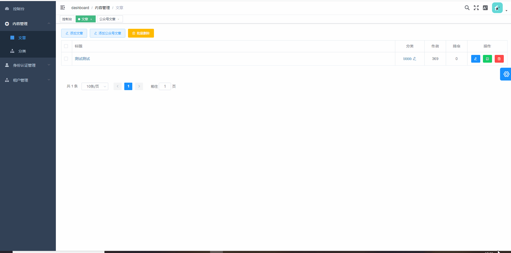


到此，本章就基本完成文章管理&富文本百度编辑器（UEditor）的使用，文章的修改、删除之类的功能就不再贴出源码，有需要的可以拉取源码看一看。内容管理系统里面还差一个上传文件（图片）的功能。下章就完成图片上传、裁剪的相关功能。

## 8) 文件上传&图片裁剪上传

- 在abp `YiAim.Cms.Application.Contracts` 里面新建Files文件夹，新建

IFileAppService.cs
```
public interface IFileAppService : IApplicationService
{
    Task<byte[]> GetAsync(string name);

    Task<string> CreateAsync(FileUploadInput input);
}
//FileUploadInput
public class FileUploadInput
    {
        [Required]
        public byte[] Bytes { get; set; }

        [Required]
        public string Name { get; set; }
    }
```
- 在 `YiAim.Cms.Application`  里面新建Files文件夹，新建
FileAppService.cs
```
[RemoteService(IsMetadataEnabled = false)]
public class FileAppService : ApplicationService, IFileAppService
{
    private readonly FileOptions _fileOptions;

    public FileAppService(IOptions<FileOptions> fileOptions)
    {
        _fileOptions = fileOptions.Value;
    }

    public Task<byte[]> GetAsync(string name)
    {
        Check.NotNullOrWhiteSpace(name, nameof(name));

        var filePath = Path.Combine(_fileOptions.BaseRoot, _fileOptions.FileUploadRootFolder, name);

        if (File.Exists(filePath))
        {
            return Task.FromResult(File.ReadAllBytes(filePath));
        }
        return Task.FromResult(new byte[0]);
    }

    public Task<string> CreateAsync(FileUploadInput input)
    {
        if (input.Bytes.IsNullOrEmpty())
        {
            throw new AbpValidationException("Bytes can not be null or empty!",
                new List<ValidationResult>
                {
                    new ValidationResult("Bytes can not be null or empty!", new[] {"Bytes"})
                });
        }

        if (input.Bytes.Length > _fileOptions.MaxFileSize)
        {
            throw new UserFriendlyException($"File exceeds the maximum upload size ({_fileOptions.MaxFileSize / 1024 / 1024} MB)!");
        }

        if (!_fileOptions.AllowedUploadFormats.Contains(Path.GetExtension(input.Name)))
        {
            throw new UserFriendlyException("Not a valid file format!");
        }
        string path = _fileOptions.FilePathFormat.Replace("{FileUploadLocalFolder}", _fileOptions.FileUploadRootFolder);
        path = path.Replace("{FileTypeFormat}", _fileOptions.IsDistinguishType ? FileUtils.GetFileTypeFormat(Path.GetExtension(input.Name)).ToString() : FileTypeFormat.file.ToString());
        path = path.Replace("{yyyy}", DateTime.Now.ToString("yyyy"))
                .Replace("{mm}", DateTime.Now.ToString("MM"))
                .Replace("{dd}", DateTime.Now.ToString("dd"));
        var fileName = Guid.NewGuid().ToString("N") + Path.GetExtension(input.Name);
        var filePath = Path.Combine(_fileOptions.BaseRoot, path, fileName);
        if (!Directory.Exists(path))
            Directory.CreateDirectory(path);
        File.WriteAllBytes(filePath, input.Bytes);
        return Task.FromResult("/" + path + fileName);
    }
}

//FileOptions
  public class FileOptions
    {
        public string BaseRoot { get; set; }
        /// <summary>
        /// 文件上传的根目录
        /// </summary>
        public string FileUploadRootFolder { get; set; } = "Upload";


        /// <summary>
        /// 是否根据文件后缀归类
        /// </summary>
        public bool IsDistinguishType { get; set; } = true;
        public string FilePathFormat { get; set; } = "{FileUploadLocalFolder}/{FileTypeFormat}/{yyyy}/{mm}{dd}/";


        /// <summary>
        /// 允许的文件最大大小单位B
        /// </summary>
        public long MaxFileSize { get; set; } = 5 * 1024 * 1024;//5MB

        /// <summary>
        /// 允许的文件类型
        /// </summary>
        public string[] AllowedUploadFormats { get; set; } = { ".jpg", ".jpeg", ".png", ".gif" };

       

    }

    public static class FileUtils
    {
        public static FileTypeFormat GetFileTypeFormat(string fileSuffix)
        {
            fileSuffix = fileSuffix.ToLower();
            if (".jpg,.jpeg,.png,.gif,webp".Contains(fileSuffix))
            {
                return FileTypeFormat.image;
            }
            if (".mp4,.3gp,.avi".Contains(fileSuffix))
            {
                return FileTypeFormat.video;
            }
            return FileTypeFormat.file;
        }
    }
    public enum FileTypeFormat
    {
        image,
        file,
        video,
    }
```

- 在 `YiAim.Cms.HttpApi`里Controllers 新建

FileController.cs
```
public class FileController : CmsController
    {
        private readonly IFileAppService _fileAppService;
        public FileController(IFileAppService fileAppService)
        {
            _fileAppService = fileAppService;
        }

        [HttpGet]
        [Route("/api/file/{name}")]
        public async Task<FileResult> GetAsync(string name)
        {
            var bytes = await _fileAppService.GetAsync(name);
            return File(bytes, MimeTypes.GetByExtension(Path.GetExtension(name)));
        }

        [HttpPost]
        [Route("/api/file/upload")]
        public async Task<string> CreateAsync(IFormFile file)
        {
            if (file == null)
                throw new UserFriendlyException("请上传文件");
            var bytes = await file.GetAllBytesAsync();
            var result = await _fileAppService.CreateAsync(new FileUploadInput()
            {
                Bytes = bytes,
                Name = file.FileName
            });
            return await Task.FromResult(result);
        }
    }
```

- 在 `YiAim.Cms.Web` 里面的 `CmsWebModule`配置

```
   private void ConfigureFile(IWebHostEnvironment hostingEnvironment)
    {
        Configure<Files.FileOptions>(options =>
        {
            options.BaseRoot = hostingEnvironment.ContentRootPath;
            options.FileUploadRootFolder = "staticfiles";
        });
    }
```

到此后台的上传文件已经完成了，可以来看一下效果

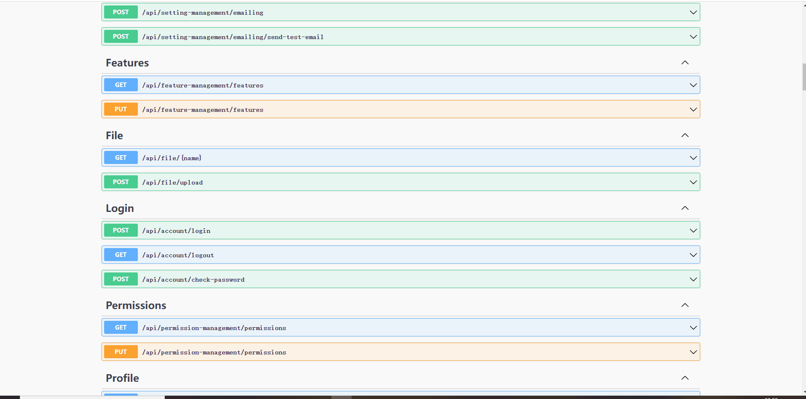


> 文件上传是很多系统都会涉及到的一个基础功能，在ABP的模块化思路下，文件管理可以做成一个通用的模块，便可以在多个项目中复用，后面也许会把 现在的文件上传相关的代码抽出变成，自己一个文件管理的模块~

后台的api文件上传完成了，现在切换到vue里面，继续完成文章管理里面的图片上传
- 在src\api 新建file.js ,然后再文章里面使用接口

```
import request from '@/utils/abpRequest'

export function upload(data) {
    return request({
      url: '/api/file/upload',
      method: 'post',
      data
    })
  }
```
el-upload 组件里自定义上传（http-request）或者直接 action="/api/file/upload"，这里使用自定义上传
```
<el-upload
          action="#"
           :before-upload="beforeUpload"
           :http-request="upload"
                                >
                                  <span style="font-size: 12px"
                                    >选择图片上传</span
                                  >
                                </el-upload>
```
js method 里面
upload(e)
```
      upload(e) {
      var filePath = e.file.name;
      var index = filePath.lastIndexOf(".");
      var ext = filePath.substr(index);
      const formData = new FormData();
      formData.append("file", e.file);
      upload(formData).then((res) => {
            let img =res;
            this.thumbList.push({
              uid: e.file.uid,
              name: img,
              status: "done",
              url: img,
              thumbUrl: img,
            });
        })
        .catch((err) => {
          e.onError(err);
        });
    },
```
到此，图片上传已经可以了！ 如下效果

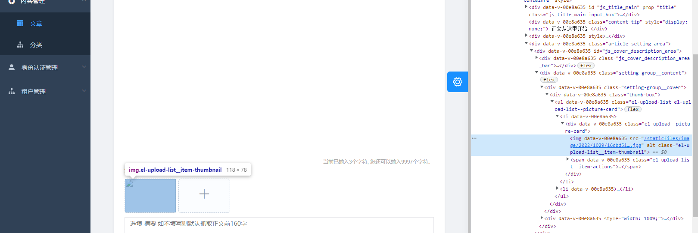

但是图片并没有显示出来，本地开发需要配置反向代理，正式部署的话可以使用nginx配置代理或者直接将vue项目跟api项目一起打包部署

- abp里面配置静态文件访问
在 `YiAim.Cms.Web`，`CmsWebModule.cs`里面OnApplicationInitialization使用（ConfigureStaticFiles）
```
private void ConfigureStaticFiles(IApplicationBuilder app)
    {
        app.UseStaticFiles();
        string staticFileRoot = Path.Combine(Directory.GetCurrentDirectory(), "staticfiles");
        if (!System.IO.Directory.Exists(staticFileRoot))
            System.IO.Directory.CreateDirectory(staticFileRoot);
        app.UseStaticFiles(new StaticFileOptions()
        {
            FileProvider = new PhysicalFileProvider(staticFileRoot),
            RequestPath = new PathString("/staticfiles"),
            //OnPrepareResponse = ctx =>
            //{
            //    ctx.Context.Response.Headers.Append("Cache-Control", "public,max-age=36000");
            //}
        });
    }
``` 
- 本地开发配置反向代理

在  `vue.config.js` 里面的 devServer里面配置

```
proxy: {
      //代理api 
      "/api": {
          target: api_root,
          changeOrigin: true,
          pathRewrite: {
              "^/api": "/api"
          }
      },
      //代理静态资源访问
      "/staticfiles": {
          target: api_root,
          changeOrigin: true,
          pathRewrite: {
              "^/staticfiles": "/staticfiles"
          }
      },
```


重写运行vue项目,此时图片已经正常显示出来了

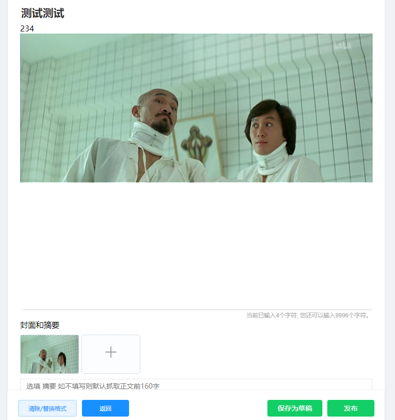

图片裁剪使用的是vue的组件 `ImageCropper`,vue-element-admin框架好像自带了裁剪功能，这里就不贴代码了，需要就拉源码吧。

到这里本章就结束了。下章来完成 接口权限，swagger上锁以及第三方登录


//对接github、gitee、qq完成多个第三方账号进行登录【多账号统一登录】


